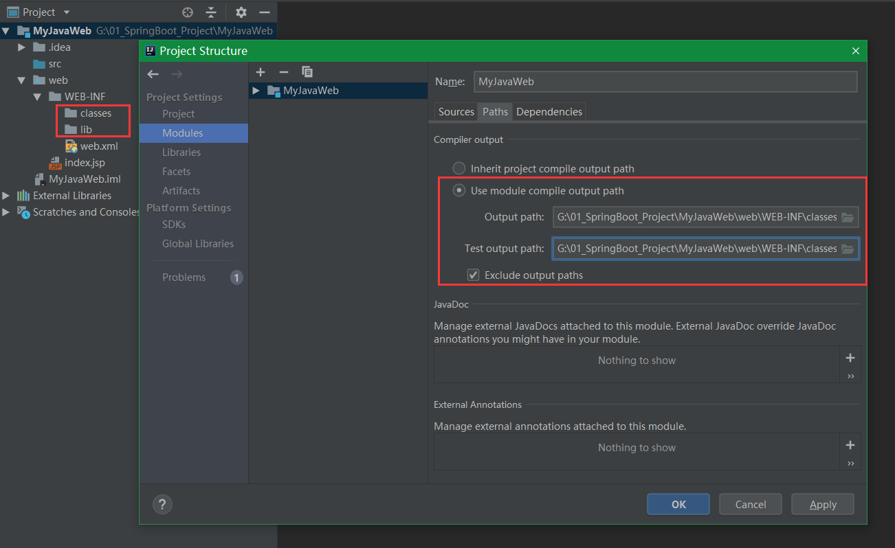
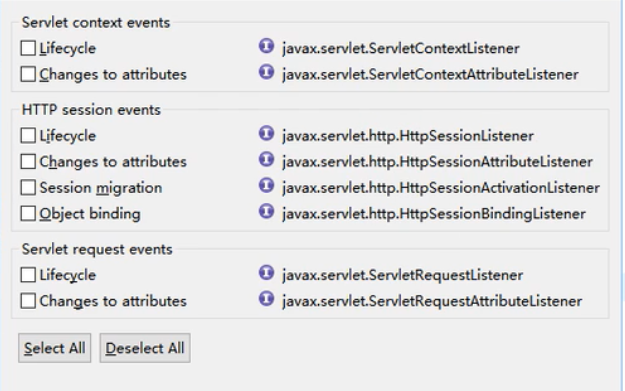

# 一、环境搭建

1、创建JavaWeb项目


2、配置web项目




# 二、三大组件

## 1、Servlet：处理请求

HttpServletRequest：

> 1）作为域对象保存数据，同一次请求期间可以共享数据；获取请求参数：request.getParameter("hello");
>
> 2）获取到 HttpSession 对象；request.getSession()；
>
> 3）转发；request.getRequestDispatcher("/index.jsp").forward(request, response)
>
> 将当次的请求和响应交给另外一个程序处理，在服务器内部处理


HttpServletRespone：

> 重定向： 浏览器收到重定向以后要发送新请求，response.sendRedirect("重定向的地址");
>
> response.sendRedirect(request.getContextPath()+"/index.jsp")

**request.getContextPath()：获取到项目名，以 / 开始不以 / 结束**


## 2、Filter：过滤请求

### 2.1 filter 配置

```xml
<filter>
    <filter-name>MyFilter</filter-name>
    <filter-class>
    </filter-class>
</filter>
<filter-mappering>
    <filter-name>MyFilter</filter-name>
    <url-pattern></url-pattern>
</filter-mappering>

```

url-pattern 三种写法

精确匹配：/pics/abc，直接拦截指定的路径

路径匹配：/pics/*，拦截 pics 下的所有请求

后缀匹配：*.html，拦截以 .html 结尾的所有请求

**不能两两组合**，如 /pics/*.html 是不合法的


### 2.2 Filter原理


## 3、Listener：监听请求

### 3.1 八大监听器




**四大域对象**

<span style="color:red">**pageContext ---》ServletRequest ---》HttpSession---》ServletContext**</span>


1）ServletContext

> ServletContext是什么：
>
> 1）一个 web 项目对应一个 ServletContext，**它代表当前 web 项目的信息**
>
> ​	context.getRealPath("/pics/aaa.png")；只能获取到当前项目下的某个资源的路径
>
> 2）还可以作为<span style="color:red">**最大的域对象在整个项目运行期间共享数据**</span>


ServletContextListener：监听ServletContext生命周期（从创建到销毁的过程，就是服务器启动创建----服务器停止销毁）

ServletContextAttributeListener：监听 ServletContext 域中属性变化


**2）HttpSession（4个）**

HttpSessionListener：监听 HttpSession的生命周期（**Session第一次使用的时候创建**；）

HttpSessionAttributeListener：监听**所有对象**在HttpSession域中属性变化（增删改）的

HttpSessionActivationListener：监听某个对象HttpSession活化钝化的

HttpSessionBindingListener：监听某个对象保存（绑定）到Session中和从Session中移除（解绑）


**3）ServletRequest（2个）**

ServletRequestListener：监听request对象的生命周期（请求进来创建新的请求request保存请求的详细信息，请求完成销毁request）

ServletRequestAttributeListener：监听 request 域中属性变化的


### 3.2 按照功能

1）监听生命周期：

ServletContextListener

> // ServletContext 销毁（服务器停止）调用
>
> **void contextDestoryd(ServletContextEvent sce)**
>
> // ServletContext 初始化（服务器启动）调用
>
> **void contextInitialized(ServletContextEvent sce)**

```java
public class MyServletContextListener implements ServletContextListener {
    @Override
    public void contextInitialized(ServletContextEvent sce) {
        System.out.println("初始化服务器.....contextInitialized");
    }

    @Override
    public void contextDestroyed(ServletContextEvent sce) {
        System.out.println("销毁服务器.....contextDestroyed");
    }
}
```

```xml
<listener>
    <listener-class>com.ireadygo.listener.MyServletContextListener</listener-class>
</listener>
```

**ServletContextListener 使用场景：**

1）服务器启动，进行初始化操作；服务器停止清理工作

2）服务器启动，将项目路径保存到

```java
public class MyServletContextListener implements ServletContextListener {
    @Override
    public void contextInitialized(ServletContextEvent sce) {
        System.out.println("初始化服务器.....contextInitialized");
        // 将整个项目要用的所有数据初始化，将项目名保存到全局域中
        ServletContext context = sce.getServletContext();
        context.setAttribute("ctp", context.getContextPath());
    }

    @Override
    public void contextDestroyed(ServletContextEvent sce) {
        System.out.println("销毁服务器.....contextDestroyed");
    }
}
```

```jsp
<a href="${ctp}/index.jsp">测试全局项目路径</a>
```


HttpSessionListener：

> //session创建调用（第一次使用Session创建）
>
>  void sessionCreated(HttpSessionEvent se)
>
> 
>
> //session自动失效（超时timeout），手动设置失效（session.invalid()）
>
> void sessionDestoryed(HttpSessionEvent se)


ServletRequestListener：

> //request销毁调用（当次请求结束）
>
> void requestDestoryed(ServletRequestEvent  sre)
>
> 
>
> //request初始化（发起一次新请求）
>
> void requestInitialized(ServletRequestEvent  sre)


**监听域中属性变化：**

ServletContextAttributeListener：

HttpSessionAttributeListener，ServletRequestAttributeListener类似

```java
/**
 * MySessionLifeCycleListener 监听所有对象的属性变化，需要注册到 web.xml中
 */
public class MySessionLifeCycleListener implements HttpSessionListener, HttpSessionAttributeListener {

    public void sessionCreated(HttpSessionEvent se) {
        System.out.println("session对象创建了......" + se.getSession().getId());
    }

    public void sessionDestroyed(HttpSessionEvent se) {
        System.out.println("session销毁了......" + se.getSession().getId());
    }

    @Override
    public void attributeAdded(HttpSessionBindingEvent se) {
        String name = se.getName();
        Object value = se.getValue();
        System.out.println("session中添加属性了 " + name + "=" + value);
    }

    @Override
    public void attributeReplaced(HttpSessionBindingEvent se) {
        System.out.println("session中替换了属性 " + se.getName() + "="
                           + " 旧值：" + se.getValue()
                           + "，新值：" + se.getSession().getAttribute(se.getName()));
    }

    @Override
    public void attributeRemoved(HttpSessionBindingEvent se) {
        System.out.println("session中移除了属性 " 
                           + se.getName() + "=" + se.getValue());
    }
}
```

监听对象的绑定、解绑

HttpSessionBindingListener

应用场景：在线人数，用户登录添加到session中，用户退出登录移除对象


# 三、Session、Cookie、Token

## 1、Session生命周期

### 1.1 创建

> 1. 第一次使用的时候创建
>
>    <span style="color:red">**第一次**</span>访问 jsp，创建内置的session；第一次访问Html，image静态资源不会
>
>    **<span style="color:red">第一次</span>** request.getSession()，也会创建 session

1）**同一浏览器**关闭，再打开，会创建新的 Session（之前的session还在，只是无法使用）

2）**不同浏览器**窗口访问同一页面会创建新的 session，**因为浏览器间不会共享 Cookie**


**不会创建Session的情况：**

> 1）浏览器内部跳转**不会创建新的 session**，Cookie中会携带JSESSIONID
>
> 2）同一浏览器多次访问页面，不会创建新的Session


### 1.2 销毁

> 1. Session超时，默认30分钟
> 2. Session手动设置失效（session.invalidate()）
>
> 注意：**<span style="color:red">不管是关闭浏览器，还是关闭服务器都不会销毁 Session</span>**

关闭浏览器**只会清除 Cookie**，**不影响 Session生命周期**

```java
@Override
protected void doPost(HttpServletRequest req, HttpServletResponse resp) throws ServletException, IOException {
    String reqParameter = req.getParameter("param");
    if ("getSession".equals(reqParameter)) {
        resp.getWriter().write(req.getSession().getId());
    } else if ("invalidateSession".equals(reqParameter)) {
        req.getSession().invalidate();
        resp.getWriter().write("session .... invalidate");
    }
}
```

```xml
<servlet>
    <servlet-name>SessionServlet</servlet-name>
    <servlet-class>com.ireadygo.listener.SessionServlet</servlet-class>
</servlet>
<servlet-mapping>
    <servlet-name>SessionServlet</servlet-name>
    <url-pattern>/sessionControll</url-pattern>
</servlet-mapping>
```


### 1.3 为什么关闭浏览器后，就再也访问不到之前的session了呢？

其实之前的Session一直都在服务器端，**而当我们关闭浏览器时，此时的Cookie是存在**

**于浏览器的进程中的，当浏览器关闭时，Cookie也就不存在了。**

其实Cookie有两种:

> **一种是存在于浏览器的进程中;**
> **一种是存在于硬盘上**


而session的Cookie是存在于浏览器的进程中，那么这种Cookie我们称为会话Cookie，

当我们重新打开浏览器窗口时，之前的Cookie中存放的Sessionid已经不存在了，**此时**

**服务器从HttpServletRequest对象中没有检查到sessionid，服务器会再发送一个新的存**

**有Sessionid的Cookie到客户端的浏览器中，此时对应的是一个新的会话，**而服务器上

原先的session等到它的默认时间到之后，便会自动销毁。

ps:

当在同一个浏览器中同时打开多个标签，发送同一个请求或不同的请求，仍是同一个session;

当不在同一个窗口中打开相同的浏览器时，发送请求，仍是同一个session;

**当使用不同的浏览器时，发送请求，即使发送相同的请求，是不同的session;**

当把当前某个浏览器的窗口全关闭，再打开，发起相同的请求时，就是本文所阐述的，是不同的session,但是它和session的生命周期是没有关系的.


### 1.4 对象的活化、钝化、绑定、解绑

```java
/**
 * 实现序列化接口
 * 不需要再 web.xml 中注册的接口
 */
public class User implements Serializable, HttpSessionActivationListener {

    /**
     * session 钝化
     */
    @Override
    public void sessionWillPassivate(HttpSessionEvent se) {
        System.out.println("user " + this + "..... 将要和 session 一起钝化了");
    }

    /**
     * session 活化
     */
    @Override
    public void sessionDidActivate(HttpSessionEvent se) {
        System.out.println("user " + this + "..... 我又回来了");
    }
}

```

```jsp
<h1>活化、钝化、绑定、解绑</h1>
<%
    User user = new User();
    session.setAttribute("loginUser",user);
%>
```

**启动服务器：**

session对象创建了......BA999C8243677491CEB5325853D9BD97
session中添加属性了 loginUser=com.ireadygo.bean.User@3cdc8394

**关闭服务器：**

user com.ireadygo.bean.User@3cdc8394..... 将要和 session 一起钝化了
销毁服务器.....contextDestroyed

默认钝化文件

C:\Users\Administrator\.IntelliJIdea2018.2\system\tomcat\Tomcat_9_0_13_MyJavaWeb\work\Catalina\localhost\MyJavaWeb\SESSIONS.ser

自定义钝化配置：路径还是以上

```xml
<?xml version="1.0" encoding="UTF-8"?>
<Context>
    <!-- maxIdleSwap:session中的对象多长时间不使用就钝化 -->
    <Manager className="org.apache.catalina.session.PersistentManager" maxIdleSwap="1">
        <Store className="org.apache.catalina.session.FileStore" 
               directory="webtest23" />
    </Manager>
</Context>
```


**再启动服务器：**

客户端不关闭，服务器关闭后，两次获取的session是同一个吗？

- 不是同一个，但是要确保数据不丢失。tomcat自动完成以下工作：
- session的钝化（保存）：
  - 在服务器正常关闭之前，将session对象系列化到硬盘上
- session的活化（读取）：
  - 在服务器启动后，将session文件转化为内存中的session对象即可。

> 这两项工作Tomcat帮我们自动完成了，IDEA只是钝化了，活化会失败，但是没有关系，因为我们将来部署项目不会在IDEA本地部署，都是在Tomcat服务器里边


## 2、Cookie

**客户端保存少量数据**

1、服务器如何给浏览器发送cookie

```java
// 1、创建Cookie
Cookie cookie = new Cookie("username","zhangsan");
resp.addCookie(cookie);
或者使用
// response.setHeader("Set-Cookie","username=wangwu");

resp.getWriter().write("give you a cookie");
```

<span style="color:red">**响应头包含：Set-Cookie: username=zhangsan**</span>

> 响应头命令浏览器保存一个 Cookie；
> Response Headers
> Content-Length: 17
> Date: Thu, 17 Oct 2019 10:50:51 GMT
> Set-Cookie: username=zhangsan


**<span style="color:red">2、浏览器一旦保存Cookie后，访问我们这个网站都会带上这个Cookie；</span>**

3、Cookie有效时间，持久化技术

​	**默认：会话默认有效（浏览器只要不关，Cookie就在；Cookie存在于浏览器进程中）**

​	setMaxAge：设置cookie的有效时间，单位秒

​	一个正数：表示多少秒后超时（cookie自动销毁）；

​	一个负数：表示cookie就是会话cookie，随浏览器同生共死；

​	0：cookie立即失效


**4、修改Cookie，同名Cookie覆盖**

```java
// 2、修改cookie，同名覆盖
Cookie cookie = new Cookie("username","lisi");
cookie.setMaxAge(0); // 在 addCookie 之前设置才生效
resp.addCookie(cookie);
```

> Content-Length: 17
>
> Date: Thu, 17 Oct 2019 10:55:27 GMT
>
> Set-Cookie: username=lisi


## 3、问题

为什么在别的地方给session中保存的数据，在另外一个地方可以获取出来；

去银行存钱，取钱一致；

1）我们和服务器进行交互期间，可能需要保存一些数据，服务器就为每个会话专门创建一个map；这个map用来保存数据；这个map我们就叫session；

2）100个会话就会有100个map；每次创建map的时候，这个map有一个唯一标示： （JSESSIONID；会话id）

利用浏览器每次访问会带上她所有的cookie；

服务器只需创建一块能保存数据的map，给这个map一个唯一标示（JSESSIONID）；创建好以后命令浏览器保存这个map的标示；以后浏览器访问就会带上这个map的标识，服务器就按照标识找到这个map，取出这个map中的数据

特别：

​	1）cookie失效：默认是cookie没了；通过cookie持久化技术继续找到之前的session；

​	2）session失效；自动超时，手动失效


## 4、Token

<span style="color:red">**防止表单重复提交**</span>


令牌机制：虎符

访问页面的时候，生成一个令牌

index.jsp{

​	String token = UUID.randomUUID().toString();

​	//分给两处

​	1、一处服务器保存，可以拿到

​	session.setAttribute("token", token);

​	2、一处页面保存，每次发送请求带上

}

```html
<form>
    <input name="token" value=/>
</form>
```

```java
SubmitServlet{
    //1、拿到服务器保存的令牌
    String token1 = session.getAttribute("token");
    //2、拿到页面带来的令牌
    String token2 = request.getParameter("token");
    if(token1.equals(token2)){
        //处理请求
        session.setAttribute("token","a") //更换token，或者一处token
    }else{
        //拒绝处理
    }
}
```


# 四、JSON 与 AJAX

## 1、 JS 对象与 JSON

发送请求，JS对象 ---》JSON 串

```javascript
var user={"name":"xiaolin","age":20}
undefined
JSON.stringify(user)
"{"name":"xiaolin","age":20}"
```

返回响应，JSON串 ---》 JS 对象

```javascript
var str = JSON.stringify(user)
undefined
// 将 json串转为 JS 对象
JSON.parse(str)
{name: "xiaolin", age: 20}
```


## 2、AJAX

<span style="color:red">**AJAX 的基础是 XMLHttpRequest**</span>

**是一种无刷新页面与服务器交互的技术**

原来的交互：

1. 发送请求

 	2. 服务器收到请求，调用对应的 Servlet 进行处理；Servlet 处理完成会有响应信息生成
 	3. 浏览器收到了服务器响应的数据，把之前的页面清除，展示新的数据；（效果就是页面刷新）

现在的交互：

1. XMLHttpRequest 对象帮我们发送请求

 	2. 服务器收到请求，调用对应的 Servlet 进行处理；Servlet 处理完成会有响应信息生成
 	3.  XMLHttpRequest 对象接收数据（浏览器感受不到这个数据了，xhr 对象收到数据） 


### 2.1 xhr原生编程

```javascript
var xhr=new XMLHttpRequest(); // 创建 xhr 对象

//向服务器发送请求
xhr.open("GET","login",true); // 建立连接
xhr.send(); // 通过地道传输数据

//服务器响应
xhr.onreadystatechange=function(){
    // xhr.readyState == 4 请求已完成
    if(xhr.readyState == 4 && xhr.status == 200){ 
        // 拿到返回的内容，字符串
        document.getElementById("myDiv").innerHTML = xhr.responseText;
    }
}
```

以前的做法实现类似 AJAX效果，**通过forward实现**（但是页面还是刷新的）

GetInfoServlet.java

```java
protected void doPost(HttpServletRequest request, HttpServletResponse response){
    request.setAttribute("msg","<h1>hahaha</h1>"
                         +UUID.randomUUID().);
    request.getRequestDispatcher("/index.jsp").forward(request,response);
}
```


### 2.2 AJAX常见请求

**点击超链接的时候一定要禁用浏览器的默认行为**

$.get(url, [data], [callback], [type])

type：返回的数据格式

```javascript
<script type="text/javascript">
    $("#aBtn").click(function(){
	// data 可以为 "k1=v1&k2=v2"，或者 js 对象（自动转为k1=v1&k2=v2）
        $.get("${ctp}/getinfo", {lastName:"xiaolin", age:18},function(data){
            //data代表服务器给我们的数据，如果服务器转发到一个页面，data代表整个页面；
            alert(data);
        });
    
        $.post("${ctp}/getinfo", "lastName=admin&age=18",function(data){
            // 第一种，将返回的字符串转为 json 对象/js 对象
            // var obj = JSON.parse(data);
            // alert(obj.lastName);
            
            // 第二种，type最后一个参数直接指定为 json，jQuery自动转为 json对象
            alert(data.lastName);
        },"json");
    	
        return false; // 阻止默认行为
	});

	$("aBtnAjax").click(functon(){
		//发送AJAX请求
        //所有请求的属性参数都是可以通过这个js对象定义的；
        var options = {
              url:"${ctp}/getstuinfo",
              type:"GET", //请求方式
              data:{"lastName":"haha", age:22}, // 发送的数据
              success:function(){
        			alert("success");
    		  },
              error:function(xhr,textStatus){
                 alert("请求失败了，"+xhr.status);
              },
              dataType:"json"
        }
        $.ajax(options);
		
		return false; // 禁用浏览器默认行为，否则超链接默认多请求一次
    });
</script>
```


# 五、文件上传于下载

## 1、文件上传

```html
<form action="" method="post" enctype="multipart/form-data">

//普通表单
<form action="" method="post" enctype="application/x-www-form-urlencode"> 默认  
```

文件上传的请求体，多部件形式

使用第三方处理：commons-fileupload/io

```java
public class UploadServlet extends HttpServlet {
    @Override
    protected void doGet(HttpServletRequest req, HttpServletResponse resp) 
        throws ServletException, IOException {
        
        doPost(req,resp);
    }

    @Override
    protected void doPost(HttpServletRequest req, HttpServletResponse resp) 
        throws ServletException, IOException {
        
        ServletInputStream inputStream = req.getInputStream();
        String str = IOUtils.toString(inputStream);
        resp.getWriter().write(str);
    }
}

```

页面 upload.jsp

```jsp
<form action="upload" method="post" enctype="multipart/form-data">
    用户名：<input type="text" name="userName"><br/>
    头像:<input type="file" name="headimg"><br/>
    <input type="submit" value="上传">
</form>
```

上传的结果：

```html
-----------------------------50481355711423
Content-Disposition: form-data; name="userName"

xiaolin
-----------------------------50481355711423
Content-Disposition: form-data; name="headimg"; filename="UploadServlet.java"
Content-Type: application/octet-stream

package com.ireadygo.fileupload;

import org.apache.commons.io.IOUtils;

import javax.servlet.ServletException;
import javax.servlet.ServletInputStream;
import javax.servlet.http.HttpServlet;
import javax.servlet.http.HttpServletRequest;
import javax.servlet.http.HttpServletResponse;
import java.io.IOException;

public class UploadServlet extends HttpServlet {
    @Override
    protected void doGet(HttpServletRequest req, HttpServletResponse resp) throws ServletException, IOException {
        doPost(req,resp);
    }

    @Override
    protected void doPost(HttpServletRequest req, HttpServletResponse resp) throws ServletException, IOException {
        ServletInputStream inputStream = req.getInputStream();
        String str = IOUtils.toString(inputStream);
        resp.getWriter().write(str);
    }
}

-----------------------------50481355711423--
```

说明：

 **-----------------------------50481355711423                            // 分割符**

**Content-Disposition: form-data; name="userName"    // 头信息**

​																							    **//  空行**，分隔内容

**xiaolin																					//  值**	
**-----------------------------50481355711423**


## 2、文件下载

<span style="color:red">**把文件流交给浏览器，一定告诉浏览器，直接下载而不要打开这个流**</span>

```java
response.setHeader("Content-Disposition","attachment;filename=tupian.jpg");
```


导入下载库jar；**如果提示找不到相关jar中的类，上移到lib上面**


# 六、jQuery

## 1、选择器

ancestor	 descendant：找后代

parent	>	child			：找所有子元素

prev		+	next			 ：找紧邻 prev 的所有 **next** 元素 （同级）

prev		~	siblings		：找所有的同辈兄弟	


first：

last：

eq（index）：

```javascript
$("a:first")  //找到第一个a标签
$(":first")  //找到文档中第一个标签 <html>
$("a :first")  //找到 a 的第一个后代元素
```

find（）：查找所有后代和子元素

children（）：查找左右子元素

```javascript
<div class="main">
    <div class="father">
        <a href="#">孙子a</a>
        <div class="son1">孙子div1</div>
        <div class="son2">孙子div2</div>
    </div>
    <a href="#">子a</a>
    <div class="father2">father2</div>
</div>

$(".main").find("div") // 返回所有子元素和后代元素
jQuery.fn.init(4) [div.father, div.son1, div.son2, div.father2, prevObject: jQuery.fn.init(1)]

$(".main").children("div")  // 只返回子元素
jQuery.fn.init(2) [div.father, div.father2, prevObject: jQuery.fn.init(1)]
```


## 2、文档的增删改

1 append（）：

```javascript
$("div.father2").append("<span>xiaolin</span>").append("<p>ppp</p>").click()

// 往father2 追加两个标签，返回的都是 $("div.father2") （jQuery对象），添加的事件也是$("div.father2")，而不是后面追加的元素
<div class="father2">
    father2
	<span>xiaolin</span>
	<p>ppp</p>
</div>
```


## 3、属性

attr：attr 可以获取原生和自定义标签的属性

prop：<span style="color:red">**prop只能获取原生属性**</span>

```javascript
<div class="main" haha="哈哈">
</div>

$(".main").attr("haha")
"哈哈"

$(".main").prop("haha")
undefined
```

关于表单 checked 状态

attr("checked")：选中返回 checked，未选中 undefined

<span style="color:red">**prop("checked")： 选中返回 true，未选中返回 false**</span>

```javascript
// 未选中
<form action="">
    <input type="checkbox">爱好
</form>

$("input[type=checkbox]").attr("checked")
undefined

$("input[type=checkbox]").prop("checked")
false

// 选中状态
<form action="">
    <input type="checkbox" checked>爱好
</form>

$("input[type=checkbox]").attr("checked")
"checked"

$("input[type=checkbox]").prop("checked")
true
```

html（）：获取html代码

text（）：返回文本

val（）：获取表单项值


# 七、乱码

## 1、请求乱码

浏览器发送给服务器的数据，服务器收到解析出来乱码

### 1.1 Get请求乱码

原因：所有的请求参数是带在 url 地址上的；Tomcat收到这个请求就会调用默认的编解码格式

（ISO-8859-1）将其解码完成；并封装成 request 对象

```java
<a href="hello?username=张三">hello</a>

String un = request.getParameter("username");
un = new String(un.getBytes("ISO-8859-1"),"UTF-8"); // Tomcat7
解决：去该服务器的配置文件：server.xml
	在8080端口配置出添加一句 URIEncoding="utf-8"

Tomcat7对URI默认编解码是ISO-8859-1

Tomcat8之后不同处理了
Tomcat8对URI默认编码是UTF-8
```

```java
<a href="garbled?username=张三">乱码测试</a>
<form action="garbled" method="post">
    <input type="text" name="p" value="李四">
    <input type="submit" value="POST提交">
</form>

public class GarbledServlet extends HttpServlet {

    @Override
    protected void doPost(HttpServletRequest req, HttpServletResponse resp) throws ServletException, IOException {
        req.setCharacterEncoding("utf-8");  // 解决 POST 乱码
        String p = req.getParameter("p");
        System.out.println("p: " + p);
    }

    @Override
    protected void doGet(HttpServletRequest req, HttpServletResponse resp) throws ServletException, IOException {
        String username = req.getParameter("username"); 
        // Tomcat8 之后服务器默认编码为 UTF-8，不用处理
        System.out.println("username: " + username);
    }
}
```

### 1.2  Post 请求乱码

原因：请求体优先使用req.setCharacterEncoding("utf-8")设置的编码，**如果没有设置（默认未设置），使用 ISO-8859-1 默认编码；**

**解决：在调用 req.getParameter（）<span style="color:red">之前</span>，req.setCharacterEncoding("utf-8");**

告诉tomcat请求体使用 utf-8编码

写，送信：

​	明信片：数据和地址在一起

​	信：信封，然后信内容

## 2、响应乱码

服务器发送给浏览器的数据，浏览器收到，解析乱码

原因：直接写出去的数据，浏览器并不知道数据的内容类型以及编码格式等。浏览器用默认的格式打开

解决：给浏览器的数据一定要说清楚这是什么？

**response.setContentType("text/html;charset=utf-8");**


## 3、总结

解决get乱码：

Tomcat安装整合好；给server.xml 8080 端口配置处加上 "URIEncoding=UTF-8"；解决所有的GET


解决post乱码

Filter：

```java
class CharacterEncodingFilter{
	...
    request.setCharacterEncoding("utf-8");
    // response.setContentType("text/html;charset=utf-8");  /* 返回img时不需要
	
    chain.doFilter(request, response);

}
```


项目路劲问题：

推荐些绝对路径：加上项目名

```java
public class MyServletContextListener implements ServletContextListener {
    @Override
    public void contextInitialized(ServletContextEvent sce) {
        System.out.println("初始化服务器.....contextInitialized");
        // 将整个项目要用的所有数据初始化，将项目名保存到全局域中
        ServletContext context = sce.getServletContext();
        context.setAttribute("ctp", context.getContextPath());
    }
    .....
}

<a href="${ctp}/index.jsp">测试全局项目路径</a>
```


# 常见问题：

## 1、浏览器关闭后，Session会话结束了么？

当用户**第一次访问**Web应用中支持Session的某个网页时，就会开始一个新的Session，

那么接下来当用户浏览这个Web应用的不同网页时，**始终处于一个Session中**

再详细些：

当一个Session开始时，Servlet容器会创建一个HttpSession对象，那么在HttpSession对象中，可以存放用户状态的信息

Servlet容器为HttpSession对象分配一个唯一标识符即Sessionid，Servlet容器把Sessionid作为一种Cookie保存在客户端的 *浏览器* 中

**用户每次发出Http请求时，Servlet容器会从HttpServletRequest对象中取出Sessionid,然后根据这个Sessionid找到相应的HttpSession对象，从而获取用户的状态信息**
**以上就是Session的运行机制**，但是还没有提到Session的生命周期，再往下了解！


**Session是存在于服务器端的，当把浏览器关闭时，浏览器并没有向服务器发送**

**任何请求来关闭Session，自然Session也不会被销毁**，但是可以做一点努力，在所有的

客户端页面里使用js的window.onclose来监视浏览器的关闭动作，然后向服务器发送一

个请求来关闭Session，但是这种做法在实际的开发中也是不推荐使用的，最正常的办法

就是不去管它，让它等到默认的时间后，自动销毁


那么为什么当我们关闭浏览器后，就再也访问不到之前的session了呢？

其实之前的Session一直都在服务器端，而Cookie是存在

于浏览器的进程中的，**当浏览器关闭时，Cookie也就不存在了。**

其实Cookie有两种:

一种是存在于浏览器的进程中;
一种是存在于硬盘上（有过期时间的Cookie自动保存到本地）

**<span style="color:red">而session的Cookie是存在于浏览器的进程中，那么这种Cookie我们称为会话Cookie</span>，**

当我们重新打开浏览器窗口时，**之前的Cookie中存放的Sessionid已经不存在了，**此时

服务器从HttpServletRequest对象中没有检查到sessionid，**服务器会再发送一个新的存**

**有Sessionid的Cookie到客户端的浏览器中，此时对应的是一个新的会话，而服务器上**

**原先的session等到它的默认时间到之后，便会自动销毁。**

ps:

**当在同一个浏览器中同时打开多个标签，发送同一个请求或不同的请求，仍是同一个session;**

当不在同一个窗口中打开相同的浏览器时，发送请求，仍是同一个session;

**当使用不同的浏览器时，发送请求，即使发送相同的请求，是不同的session;**

当把某个浏览器的窗口全关闭，再打开，发起相同的请求时，就是本文所阐述的，**是不同的session,但是它和session的生命周期是没有关系的.**

参考：https://blog.csdn.net/stanxl/article/details/47105051