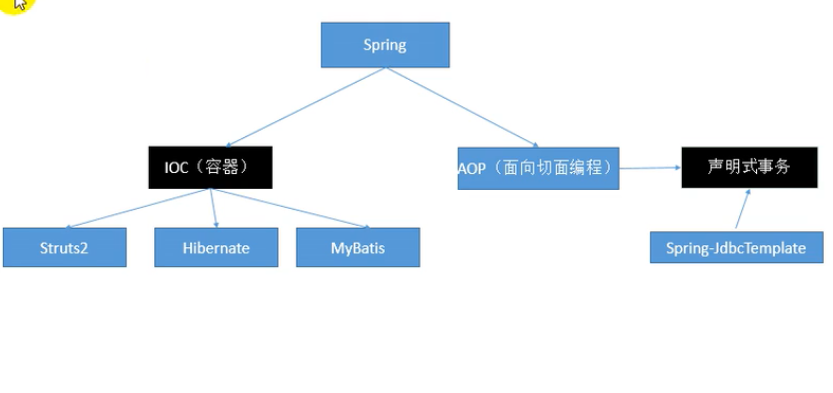
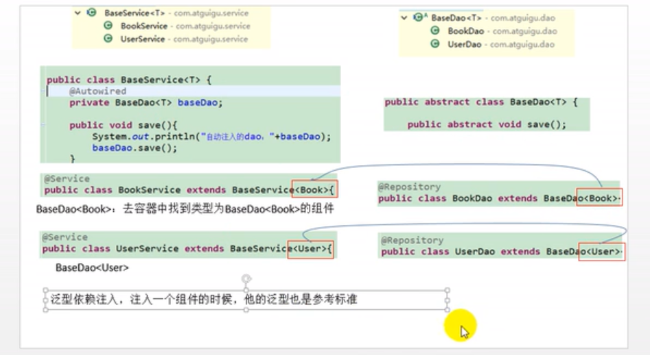

# 一、框架概述

## 1、框架模块


## 2、IOC+AOP用途



# 二、IOC

引入依赖

```xml
<dependency>
    <groupId>org.springframework</groupId>
    <artifactId>spring-context</artifactId>
    <version>5.2.0.RELEASE</version>
</dependency>
```


## 1、bean注册细节

```java
public class Person {

    private String lastName;
    private Integer age;
    private String email;
    private String gender;

    public Person() {
        System.out.println("创建Person对象...");
    }

    public String getLastName() {
        return lastName;
    }

    public void setLastName(String lastName) {
        System.out.println("setLastName... "+lastName);
        this.lastName = lastName;
    }
    
    ...
}
```

注册Person：

```xml
<bean id="person" class="com.ireadygo.bean.Person">
    <property name="lastName" value="xiaolin"/>
    <property name="age" value="20"/>
    <property name="email" value="466621071@qq.com"/>
    <property name="gender" value="男"/>
</bean>
```

测试从容器中获取 person 对象

```java
@Test
public void testIoc() {
    ApplicationContext context = 
        new ClassPathXmlApplicationContext("application.xml");
    System.out.println("容器已创建完成...");
    //Person person = (Person) context.getBean("person");
    Person person = context.getBean("person",Person.class);
    System.out.println(person);
}
```

**打印：**

创建Person对象...
setLastName... xiaolin
容器已创建完成...
Person{lastName='xiaolin', age=20, email='466621071@qq.com', gender='男'}


**总结**

 1. ioc容器在创建组件对象的时候，（property）会利用 **<span style="color:red">setter</span>** 方法为 JavaBean 的属性进行赋值

 2. JavaBean 的属性名是由什么决定的？getter/setter 方法是属性名；set去掉后面那一串首字符小写就是属性名；

    private String lastName;

    setter/getter 自动生成	

    

**问题：在Spring框架中bean配置文件中constructor-arg标签中没有name元素?**

bean配置文件出现错误的依赖：

<beans
<beans xmlns="http://www.springframework.org/schema/beans"
    xmlns:xsi="http://www.w3.org/2001/XMLSchema-instance"
    xsi:schemaLocation="http://www.springframework.org/schema/beans 
                              http://www.springframework.org/schema/beans/spring-beans.xsd">

 

将以上依赖改成：

<beans xmlns="http://www.springframework.org/schema/beans"
    xmlns:xsi="http://www.w3.org/2001/XMLSchema-instance"
    xmlns:p="http://www.springframework.org/schema/p"
    xsi:schemaLocation="http://www.springframework.org/schema/beans http://www.springframework.org/schema/beans/spring-beans-3.0.xsd">

 

## 2 Bean赋值

### 2.1 引用类型赋值

```xml
<bean id="car" class="com.ireadygo.bean.Car">
    <property name="carName" value="宝马"/>
    <property name="price" value="30000"/>
    <property name="color" value="白色"/>
</bean>
<bean id="personHasCar" class="com.ireadygo.bean.Person">
    <property name="lastName">
        <!--进行复杂的赋值-->
        <null/>
    </property>

    <property name="car" ref="car"/>
</bean>
```

```java
Person personHasCar = context.getBean("personHasCar", Person.class);
System.out.println(personHasCar.getCar());
```

Car{carName='宝马', price=30000, color='白色'}


引入内部bean

```xml
<bean id="personHasCar" class="com.ireadygo.bean.Person">
    <property name="lastName">
        <!--进行复杂的赋值-->
        <null/>
    </property>

    <!--<property name="car" ref="car"/>-->
   
    <property name="car">
        <!--内部定义的bean，不能获取到，id无用-->
        <bean class="com.ireadygo.bean.Car">
            <property name="carName" value="自行车"/>
        </bean>
    </property>
</bean>
```

Car{carName='自行车', price=null, color='null'}

### 2.2 list 类型赋值

```xml
<bean id="book" class="com.ireadygo.bean.Book">
    <property name="bookName" value="西游记"/>
    <property name="author" value="吴承恩"/>
</bean>
<bean id="personHasBooks" class="com.ireadygo.bean.Person">
    <property name="books">
        <list>
            <!--引用外部bean-->
            <ref bean="book"/>
            <!--内部定义的bean，不能获取到，id无用-->
            <bean class="com.ireadygo.bean.Book">
                <property name="bookName" value="金瓶梅"/>
                <property name="author" value="三笑"/>
            </bean>
        </list>
    </property>
</bean>
```

[Book{bookName='西游记', author='吴承恩'}, Book{bookName='金瓶梅', author='三笑'}]

### 2.3 map 和 properties 对象赋值

```xml
<property name="maps">
    <map>
        <entry key="key01" value="123"></entry>
        <entry key="key02" value-ref="book"/>
    </map>
</property>

<property name="properties">
    <props>
        <!-- k=v 都是String，值直接写在标签体中-->
        <prop key="username">xiaolin</prop>
        <prop key="password">123465</prop>
    </props>
</property>
```

{key01=123, key02=Book{bookName='西游记', author='吴承恩'}}
{password=123465, username=xiaolin}

使用 **util:map** 提取共有的元素，复用

```xml

<util:map id="utilMap">
    <entry key="name" value="xiaoying"></entry>
    <entry key="age" value="11"></entry>
</util:map>
<bean id="personHasMaps" class="com.ireadygo.bean.Person">
    <property name="maps" ref="utilMap"/>
</bean>
```

```java
Person personHasMaps = context.getBean("personHasMaps", Person.class);
System.out.println(personHasMaps.getMaps());

Map<String,Object> maps = context.getBean("utilMap", Map.class);
System.out.println(maps.getClass());
```

{name=xiaoying, age=11}
class java.util.LinkedHashMap

### 2.4 通过继承实现 bean 配置信息的重用

**如果父的bean如果添加  abstract=true 属性**，不能通过getBean获取父bean

```xml
<!--parent：指定当前bean的配置信息继承于哪个，只继承没有的属性-->
<bean id="personExtend" class="com.ireadygo.bean.Person" parent="person">
    <property name="lastName" value="大王"/>
</bean>
```

Person{lastName='大王', age=20, email='466621071@qq.com', gender='男'}


## 3、使用工厂创建 bean

```java
public class AirplaneStaticFactory {

    public static Airplane getAirplane(String model) {
        Airplane airplane = new Airplane(model);
        airplane.setCustomerNums(100);
        return airplane;
    }
}

public class AirplaneInstanceFactory {

    public Airplane getAirplane(String model) {
        Airplane airplane = new Airplane(model);
        airplane.setCustomerNums(100);
        return airplane;
    }
}
```


```xml
<!-- 静态工厂不需要创建工厂本身-->
<bean id="airplane" class="com.ireadygo.factory.AirplaneStaticFactory" 
      factory-method="getAirplane">
    <!-- 创建 Airplane 实例的构造器参数-->
    <constructor-arg value="MH370"/>
</bean>

<bean id="airplaneInstanceFactory" class="com.ireadygo.factory.AirplaneInstanceFactory"/>
<!--airplaneByInstanceFactory 由实例工厂创建-->
<bean id="airplaneByInstanceFactory" class="com.ireadygo.bean.Airplane" 			factory-bean="airplaneInstanceFactory"
      factory-method="getAirplane">
    <constructor-arg value="A830"/>
</bean>
```

```java
@Test
public void testIoc() {
    Airplane airplane = context.getBean("airplane", Airplane.class);
    System.out.println(airplane);

    Airplane airplaneByInstanceFactory 
        = context.getBean("airplaneByInstanceFactory", Airplane.class);
    System.out.println(airplaneByInstanceFactory);
}
```

Airplane{model='MH370', customerNums=100}
Airplane{model='A830', customerNums=100}

### 4、使用FactoryBean 创建bean

```java
public class BookFactoryBean implements FactoryBean<Book> {
    public Book getObject() throws Exception {
        Book book = new Book();
        book.setBookName(UUID.randomUUID().toString());
        return book;
    }

    public Class<?> getObjectType() {
        return Book.class;
    }

    public boolean isSingleton() {
        return false;
    }
}
```

```xml
<bean id="bookFactoryBean" class="com.ireadygo.factory.BookFactoryBean"/>
```

```java
Object object = context.getBean("bookFactoryBean");
System.out.println(object);
```

Book{bookName='1fa35822-aa40-465a-a654-e9e0dd1ff832', author='null'}


### 5、@Autowired

```java
@Controller
public class BookController {

    /**
     * 1、先按照类型去容器找组件
     *      找到：
     *          一个：装配
     *          多个：按照变量名（作为id）继续匹配
     *              找到：装配
     *              未找到：异常，可以使用 @Qualifier("bookService") 指定 id
     *      未找到：异常
     */
//    @Qualifier("bookService") 指定一个名为id，让Spring不要使用变量名作为 id
    @Autowired
//    BookService bookService;
    BookService bookServiceExt;

    public void doGet(){
//        bookService.saveBook();
        bookServiceExt.saveBook();
    }
}
```

多个 BookService

```java
@Service
public class BookService {

    @Autowired
    BookDao bookDao;

    public void saveBook() {
        System.out.println("BookService....saveBook");
        bookDao.saveBook();
    }
}

@Service
public class BookServiceExt extends BookService {
    @Autowired
    BookDao bookDao;

    public void saveBook() {
        System.out.println("BookServiceExt...saveBook");
        bookDao.saveBook();
    }
}
```

```java
@Repository
public class BookDao {

    public void saveBook() {
        System.out.println("BookDao....saveBook");
    }
}
```

测试

```java
/**
 * 注解依赖 aop 包
 */
public class AnnotationTest {

    ApplicationContext context = 
        new ClassPathXmlApplicationContext("ioc-annotation.xml");
    @Test
    public void testAnnotation(){
        BookController controller = context.getBean(BookController.class);
        controller.doGet();
    }
}
```

BookServiceExt...saveBook
BookDao....saveBook


@Autowired 与@Resource区别

**@Autowired：Spring自己，功能强大；扩展弱**

**@Resource：j2ee标准，扩展性更强**；如果切换成另外一个容器框架，@Resource还是可以使用，@Autowired就不行


## 6、泛型注入

```java
//@Service 不能加到容器中，否则报错
// No qualifying bean of type 'com.ireadygo.generic.BaseDao<?>' available:
// expected single matching bean but found 2: carDao,userDao
public class BaseService<T> {

    @Autowired
    BaseDao<T> baseDao;

    public void save() {
        baseDao.save();
    }
}
```

```java
@Service
public class CarService extends BaseService<Car> {

}

@Service
public class UserService extends BaseService<User> {
}

```

```java
public abstract class BaseDao<T> {
   protected abstract void save();
}

@Repository
public class UserDao extends BaseDao<User> {
    protected void save() {
        System.out.println("保存用户....");
    }
}

@Repository
public class CarDao extends BaseDao<Car> {
    @Override
    protected void save() {
        System.out.println("保存汽车....");
    }
}

```

```xml
xmlns:context="http://www.springframework.org/schema/context"

<context:component-scan base-package="com.ireadygo"/>
```

测试：

```java
@Test
public void testGeneric(){
    UserService userService = context.getBean(UserService.class);
    CarService carService = context.getBean(CarService.class);

    userService.save();
    carService.save();

    System.out.println(userService.getClass().getGenericSuperclass());
}
```

保存用户....
保存汽车....
com.ireadygo.generic.BaseService<com.ireadygo.bean.User>

