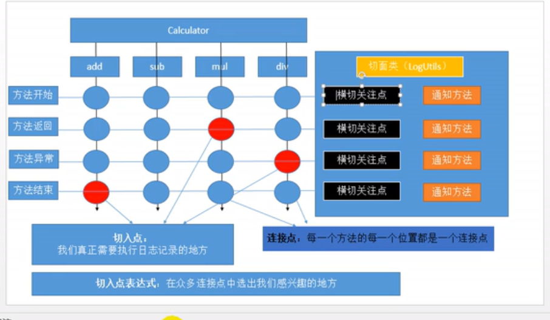

# 一、框架概述

## 1、框架模块


## 2、IOC+AOP用途


# 二、IOC

引入依赖

```xml
<dependency>
    <groupId>org.springframework</groupId>
    <artifactId>spring-context</artifactId>
    <version>5.2.0.RELEASE</version>
</dependency>
```


## 1、bean注册细节

```java
public class Person {

    private String lastName;
    private Integer age;
    private String email;
    private String gender;

    public Person() {
        System.out.println("创建Person对象...");
    }

    public String getLastName() {
        return lastName;
    }

    public void setLastName(String lastName) {
        System.out.println("setLastName... "+lastName);
        this.lastName = lastName;
    }
    
    ...
}
```

注册Person：

```xml
<bean id="person" class="com.ireadygo.bean.Person">
    <property name="lastName" value="xiaolin"/>
    <property name="age" value="20"/>
    <property name="email" value="466621071@qq.com"/>
    <property name="gender" value="男"/>
</bean>
```

测试从容器中获取 person 对象

```java
@Test
public void testIoc() {
    ApplicationContext context = 
        new ClassPathXmlApplicationContext("application.xml");
    System.out.println("容器已创建完成...");
    //Person person = (Person) context.getBean("person");
    Person person = context.getBean("person",Person.class);
    System.out.println(person);
}
```

**打印：**

创建Person对象...
setLastName... xiaolin
容器已创建完成...
Person{lastName='xiaolin', age=20, email='466621071@qq.com', gender='男'}


**总结**

 1. ioc容器在创建组件对象的时候，（property）会利用 **<span style="color:red">setter</span>** 方法为 JavaBean 的属性进行赋值

 2. JavaBean 的属性名是由什么决定的？getter/setter 方法是属性名；set去掉后面那一串首字符小写就是属性名；

    private String lastName;

    setter/getter 自动生成	

    

**问题：在Spring框架中bean配置文件中constructor-arg标签中没有name元素?**

bean配置文件出现错误的依赖：

<beans
<beans xmlns="http://www.springframework.org/schema/beans"
    xmlns:xsi="http://www.w3.org/2001/XMLSchema-instance"
    xsi:schemaLocation="http://www.springframework.org/schema/beans 
                              http://www.springframework.org/schema/beans/spring-beans.xsd">

 

将以上依赖改成：

<beans xmlns="http://www.springframework.org/schema/beans"
    xmlns:xsi="http://www.w3.org/2001/XMLSchema-instance"
    xmlns:p="http://www.springframework.org/schema/p"
    xsi:schemaLocation="http://www.springframework.org/schema/beans http://www.springframework.org/schema/beans/spring-beans-3.0.xsd">

 

## 2、Bean赋值

### 2.1 引用类型赋值

```xml
<bean id="car" class="com.ireadygo.bean.Car">
    <property name="carName" value="宝马"/>
    <property name="price" value="30000"/>
    <property name="color" value="白色"/>
</bean>
<bean id="personHasCar" class="com.ireadygo.bean.Person">
    <property name="lastName">
        <!--进行复杂的赋值-->
        <null/>
    </property>

    <property name="car" ref="car"/>
</bean>
```

```java
Person personHasCar = context.getBean("personHasCar", Person.class);
System.out.println(personHasCar.getCar());
```

Car{carName='宝马', price=30000, color='白色'}


引入内部bean

```xml
<bean id="personHasCar" class="com.ireadygo.bean.Person">
    <property name="lastName">
        <!--进行复杂的赋值-->
        <null/>
    </property>

    <!--<property name="car" ref="car"/>-->
   
    <property name="car">
        <!--内部定义的bean，不能获取到，id无用-->
        <bean class="com.ireadygo.bean.Car">
            <property name="carName" value="自行车"/>
        </bean>
    </property>
</bean>
```

Car{carName='自行车', price=null, color='null'}

### 2.2 list 类型赋值

```xml
<bean id="book" class="com.ireadygo.bean.Book">
    <property name="bookName" value="西游记"/>
    <property name="author" value="吴承恩"/>
</bean>
<bean id="personHasBooks" class="com.ireadygo.bean.Person">
    <property name="books">
        <list>
            <!--引用外部bean-->
            <ref bean="book"/>
            <!--内部定义的bean，不能获取到，id无用-->
            <bean class="com.ireadygo.bean.Book">
                <property name="bookName" value="金瓶梅"/>
                <property name="author" value="三笑"/>
            </bean>
        </list>
    </property>
</bean>
```

[Book{bookName='西游记', author='吴承恩'}, Book{bookName='金瓶梅', author='三笑'}]

### 2.3 map 和 properties 对象赋值

```xml
<property name="maps">
    <map>
        <entry key="key01" value="123"></entry>
        <entry key="key02" value-ref="book"/>
    </map>
</property>

<property name="properties">
    <props>
        <!-- k=v 都是String，值直接写在标签体中-->
        <prop key="username">xiaolin</prop>
        <prop key="password">123465</prop>
    </props>
</property>
```

{key01=123, key02=Book{bookName='西游记', author='吴承恩'}}
{password=123465, username=xiaolin}

使用 **util:map** 提取共有的元素，复用

```xml

<util:map id="utilMap">
    <entry key="name" value="xiaoying"></entry>
    <entry key="age" value="11"></entry>
</util:map>
<bean id="personHasMaps" class="com.ireadygo.bean.Person">
    <property name="maps" ref="utilMap"/>
</bean>
```

```java
Person personHasMaps = context.getBean("personHasMaps", Person.class);
System.out.println(personHasMaps.getMaps());

Map<String,Object> maps = context.getBean("utilMap", Map.class);
System.out.println(maps.getClass());
```

{name=xiaoying, age=11}
class java.util.LinkedHashMap

### 2.4 通过继承实现 bean 配置信息的重用

**如果父的bean如果添加  abstract=true 属性**，不能通过getBean获取父bean

```xml
<!--parent：指定当前bean的配置信息继承于哪个，只继承没有的属性-->
<bean id="personExtend" class="com.ireadygo.bean.Person" parent="person">
    <property name="lastName" value="大王"/>
</bean>
```

Person{lastName='大王', age=20, email='466621071@qq.com', gender='男'}


## 3、使用工厂创建 bean

```java
public class AirplaneStaticFactory {

    public static Airplane getAirplane(String model) {
        Airplane airplane = new Airplane(model);
        airplane.setCustomerNums(100);
        return airplane;
    }
}

public class AirplaneInstanceFactory {

    public Airplane getAirplane(String model) {
        Airplane airplane = new Airplane(model);
        airplane.setCustomerNums(100);
        return airplane;
    }
}
```


```xml
<!-- 静态工厂不需要创建工厂本身-->
<bean id="airplane" class="com.ireadygo.factory.AirplaneStaticFactory" 
      factory-method="getAirplane">
    <!-- 创建 Airplane 实例的构造器参数-->
    <constructor-arg value="MH370"/>
</bean>

<bean id="airplaneInstanceFactory" class="com.ireadygo.factory.AirplaneInstanceFactory"/>
<!--airplaneByInstanceFactory 由实例工厂创建-->
<bean id="airplaneByInstanceFactory" class="com.ireadygo.bean.Airplane" 			factory-bean="airplaneInstanceFactory"
      factory-method="getAirplane">
    <constructor-arg value="A830"/>
</bean>
```

```java
@Test
public void testIoc() {
    Airplane airplane = context.getBean("airplane", Airplane.class);
    System.out.println(airplane);

    Airplane airplaneByInstanceFactory 
        = context.getBean("airplaneByInstanceFactory", Airplane.class);
    System.out.println(airplaneByInstanceFactory);
}
```

Airplane{model='MH370', customerNums=100}
Airplane{model='A830', customerNums=100}

### 4、使用FactoryBean 创建bean

```java
public class BookFactoryBean implements FactoryBean<Book> {
    public Book getObject() throws Exception {
        Book book = new Book();
        book.setBookName(UUID.randomUUID().toString());
        return book;
    }

    public Class<?> getObjectType() {
        return Book.class;
    }

    public boolean isSingleton() {
        return false;
    }
}
```

```xml
<bean id="bookFactoryBean" class="com.ireadygo.factory.BookFactoryBean"/>
```

```java
Object object = context.getBean("bookFactoryBean");
System.out.println(object);
```

Book{bookName='1fa35822-aa40-465a-a654-e9e0dd1ff832', author='null'}


### 5、@Autowired

```java
@Controller
public class BookController {

    /**
     * 1、先按照类型去容器找组件
     *      找到：
     *          一个：装配
     *          多个：按照变量名（作为id）继续匹配
     *              找到：装配
     *              未找到：异常，可以使用 @Qualifier("bookService") 指定 id
     *      未找到：异常
     */
//    @Qualifier("bookService") 指定一个名为id，让Spring不要使用变量名作为 id
    @Autowired
//    BookService bookService;
    BookService bookServiceExt;

    public void doGet(){
//        bookService.saveBook();
        bookServiceExt.saveBook();
    }
}
```

多个 BookService

```java
@Service
public class BookService {

    @Autowired
    BookDao bookDao;

    public void saveBook() {
        System.out.println("BookService....saveBook");
        bookDao.saveBook();
    }
}

@Service
public class BookServiceExt extends BookService {
    @Autowired
    BookDao bookDao;

    public void saveBook() {
        System.out.println("BookServiceExt...saveBook");
        bookDao.saveBook();
    }
}
```

```java
@Repository
public class BookDao {

    public void saveBook() {
        System.out.println("BookDao....saveBook");
    }
}
```

测试

```java
/**
 * 注解依赖 aop 包
 */
public class AnnotationTest {

    ApplicationContext context = 
        new ClassPathXmlApplicationContext("ioc-annotation.xml");
    @Test
    public void testAnnotation(){
        BookController controller = context.getBean(BookController.class);
        controller.doGet();
    }
}
```

BookServiceExt...saveBook
BookDao....saveBook


@Autowired 与@Resource区别

**@Autowired：Spring自己，功能强大；扩展弱**

**@Resource：j2ee标准，扩展性更强**；如果切换成另外一个容器框架，@Resource还是可以使用，@Autowired就不行


## 4、泛型注入

```java
//@Service 不能加到容器中，否则报错
// No qualifying bean of type 'com.ireadygo.generic.BaseDao<?>' available:
// expected single matching bean but found 2: carDao,userDao
public class BaseService<T> {

    @Autowired
    BaseDao<T> baseDao;

    public void save() {
        baseDao.save();
    }
}
```

```java
@Service
public class CarService extends BaseService<Car> {

}

@Service
public class UserService extends BaseService<User> {
}

```

```java
public abstract class BaseDao<T> {
   protected abstract void save();
}

@Repository
public class UserDao extends BaseDao<User> {
    protected void save() {
        System.out.println("保存用户....");
    }
}

@Repository
public class CarDao extends BaseDao<Car> {
    @Override
    protected void save() {
        System.out.println("保存汽车....");
    }
}

```

```xml
xmlns:context="http://www.springframework.org/schema/context"

<context:component-scan base-package="com.ireadygo"/>
```

测试：

```java
@Test
public void testGeneric(){
    UserService userService = context.getBean(UserService.class);
    CarService carService = context.getBean(CarService.class);

    userService.save();
    carService.save();

    System.out.println(userService.getClass().getGenericSuperclass());
}
```

保存用户....
保存汽车....
com.ireadygo.generic.BaseService<com.ireadygo.bean.User>


# 三、AOP

## 1、jdk动态代理

如果目标对象没有实现任何接口，jdk动态代理无法为目标对象创建代理

代理对象与被代理对象唯一产生的关联是实现了同样的接口

## 2、AOP术语




## 3、通知注解

```java
try{

	@Before

​	doSomething();

​	@AfterReturning ：目标方法正常返回之后调用

}catch(Exception e){

	@AfterThrowing

}finally{

​	@After：目标方法结束之后

}
```

## 4、AOP测试

1）引入依赖

```xml
<dependency>
    <groupId>org.springframework</groupId>
    <artifactId>spring-context</artifactId>
    <version>5.1.3.RELEASE</version>
</dependency>
<dependency>
    <groupId>org.springframework</groupId>
    <artifactId>spring-aop</artifactId>
    <version>5.1.3.RELEASE</version>
</dependency>
<dependency>
    <groupId>org.aspectj</groupId>
    <artifactId>aspectjweaver</artifactId>
    <version>1.9.4</version>
</dependency>
```

2）开启AOP功能

```xml
<!--开启AOP功能-->
<aop:aspectj-autoproxy/>
```

3）业务逻辑

```java
public interface Calculator {

    int add(int i, int j);

    int sub(int i, int j);

    int mul(int i, int j);

    int div(int i, int j);
}

@Component
public class MyMathCalculator implements Calculator {
    public int add(int i, int j) {
        int result = i + j;
        return result;
    }

    public int sub(int i, int j) {
        int result = i - j;
        return result;
    }

    public int mul(int i, int j) {
        int result = i * j;
        return result;
    }

    public int div(int i, int j) {
        int result = i / j;
        return result;
    }
}
```

4）切面类

```java
@Aspect
@Component
public class LogUtils {

    // 切点表达式  execution(访问权限符 返回值 方法签名)
    @Before("execution(int com.ireadygo.aop.business.MyMathCalculator.*(int ,int ))")
    public static void logStart() {
        System.out.println("xxx方法开始运行，用的参数列表xxx");
    }

    @AfterReturning("execution(int com.ireadygo.aop.business.MyMathCalculator.*(int ,int ))")
    public static void logReturn() {
        System.out.println("xxx方法正常执行完成，计算结果是：");
    }

    @AfterThrowing("execution(int com.ireadygo.aop.business.MyMathCalculator.*(int ,int ))")
    public static void logException() {
        System.out.println("xxx方法执行出现异常了，异常信息是");
    }

    @After("execution(int com.ireadygo.aop.business.MyMathCalculator.*(int ,int ))")
    public static void logEnd() {
        System.out.println("xxx方法最终结束了");
    }

}
```


## 5、AOP细节

### 1）IOC容器保存的是代理对象

```xml
Calculator calculator = context.getBean(Calculator.class); // 必须是接口而不是实现类
calculator.add(1,2);
System.out.println("calculator: "+calculator);
System.out.println(calculator.getClass());

calculator: com.ireadygo.aop.business.MyMathCalculator@22fcf7ab
class com.sun.proxy.$Proxy16
```

### 2）不实现接口

```java
@Component
public class MyMathCalculatorNoInterface {
    public int add(int i, int j) {
        int result = i + j;
        return result;
    }

    public int sub(int i, int j) {
        int result = i - j;
        return result;
    }

    public int mul(int i, int j) {
        int result = i * j;
        return result;
    }

    public int div(int i, int j) {
        int result = i / j;
        return result;
    }
}

@Aspect
@Component
public class LogUtilsNoInterface {

    // 切点表达式  execution(访问权限符 返回值 方法签名)
    @Before("execution(int com.ireadygo.aop.business.MyMathCalculatorNoInterface.*(int ,int ))")
    public static void logStart() {
        System.out.println("xxx方法开始运行，用的参数列表xxx");
    }

    @AfterReturning("execution(int com.ireadygo.aop.business.MyMathCalculatorNoInterface.*(int ,int ))")
    public static void logReturn() {
        System.out.println("xxx方法正常执行完成，计算结果是：");
    }

    @AfterThrowing("execution(int com.ireadygo.aop.business.MyMathCalculatorNoInterface.*(int ,int ))")
    public static void logException() {
        System.out.println("xxx方法执行出现异常了，异常信息是");
    }

    @After("execution(int com.ireadygo.aop.business.MyMathCalculatorNoInterface.*(int ,int ))")
    public static void logEnd() {
        System.out.println("xxx方法最终结束了");
    }

}
```

```java
@Test
public void testNoInterface(){
    // cglib帮我们创建的代理对象
    MyMathCalculatorNoInterface calculator = context
        .getBean(MyMathCalculatorNoInterface.class);
    calculator.add(1,2);
    System.out.println(calculator.getClass());
}

class com.ireadygo.aop.business.MyMathCalculatorNoInterface$$EnhancerBySpringCGLIB$$a80fa76f
```

### 3）切入点表达式

1）匹配某个参数任意类型

```java
	
/**
     * 通配符
     *      *
     *      1）匹配一个或多个字符
     *      2）匹配任意一个参数；第一个参数是 int 类型，第二个参数任意类型（匹配两个参数）
 @Before("execution(int com.ireadygo.aop.business.MyMathCalculator.*(int , * ))")
     *      3）只能匹配一层路径
     *
     *       ..
     *       1）匹配任意多个参数，任意类型参数
     * @Before("execution(int com.ireadygo.aop.business.MyMathCalculator.*(..))")
     *       2）匹配任意多层路径
@Before("execution(int com.ireadygo.aop..MyMathCalculatorNoInterface.*(int ,* ))")
     *
     *
     *       最模糊的：execution("* *(..)") 或 execution("* *.*(..)")
     */
@Before("execution(int com.ireadygo.aop.business.MyMathCalculator.*(int ,* ))")
public static void logStart() {
    System.out.println("xxx方法开始运行，用的参数列表xxx");
}
```

### 4）执行顺序

正常执行：@Before----》@After----》@AfterReturning（正常返回）

异常执行：@Before----》@After----》@AfterThrowing（方法异常）

### 5）获取方法运行时信息、返回值即异常

```java
@Aspect
@Component
public class LogUtils {

    // JoinPoint 获取方法运行时信息
    @Before("execution(int com.ireadygo.aop.business.MyMathCalculator.*(int ,int ))")
    public static void logStart(JoinPoint joinPoint) {
        Signature signature = joinPoint.getSignature();
        System.out.println("@Before [" + signature.getName() 
                           + " ]方法开始运行，用的参数列表:" 
                           + Arrays.asList(joinPoint.getArgs()));
    }

    // returning = "result" 配置方法返回值
    @AfterReturning(value = "execution(int com.ireadygo.aop.business.MyMathCalculator.*(int ,int ))", returning = "result")
    public static void logReturn(JoinPoint joinPoint, Object result) {
        Signature signature = joinPoint.getSignature();
        System.out.println("@AfterReturning [" + signature.getName() 
                           + " ]方法正常执行完成，计算结果是：" + result);
    }

    @AfterThrowing(value = "execution(int com.ireadygo.aop.business.MyMathCalculator.*(int ,int ))", throwing = "ex")
    public static void logException(JoinPoint joinPoint, Exception ex) {
        Signature signature = joinPoint.getSignature();
        System.out.println("@AfterThrowing [" + signature.getName() 
                           + " ]方法执行出现异常了，异常信息是: " + ex);
    }

    @After("execution(int com.ireadygo.aop.business.MyMathCalculator.*(int ,int ))")
    public static void logEnd(JoinPoint joinPoint) {
        Signature signature = joinPoint.getSignature();
        System.out.println("@After [" + signature.getName() + " ]方法最终结束了");
    }

}
```

1）使用 JoinPoint 获取方法签名信息

2）配置方法返回值信息，**告诉Spring使用 result 接收结果**

 @AfterReturning(value = "execution(int com.ireadygo.aop.*(int ,int ))", **returning = "result"**)

public static void logReturn(JoinPoint joinPoint, **Object result**) {

}

3）配置异常信息，**告诉Spring使用 ex 接收异常信息**

@AfterThrowing(value = "execution(int com.ireadygo.aop.business.*(int ,int ))", **throwing = "ex"**)
public static void logException(JoinPoint joinPoint, **Exception ex**) {

}


### 6）提取可重用的切点表达式

```java
// 提取可重用的切点表达式
@Pointcut("execution(int com.ireadygo.aop.business.MyMathCalculator.*(int ,int ))")
public void commonPointcut(){

}

// returning = "result" 配置方法返回值
@AfterReturning(value = "commonPointcut()", returning = "result")
public static void logReturn(JoinPoint joinPoint, Object result) {
    Signature signature = joinPoint.getSignature();
    System.out.println("@AfterReturning [" + signature.getName() + " ]方法正常执行完成，计算结果是：" + result);
}

@AfterThrowing(value = "commonPointcut()", throwing = "ex")
public static void logException(JoinPoint joinPoint, Exception ex) {
    Signature signature = joinPoint.getSignature();
    System.out.println("@AfterThrowing [" + signature.getName() + " ]方法执行出现异常了，异常信息是: " + ex);
}
```


## 6、@Around

```java
@Around(value = "commonPointcut()")
public Object myAround(ProceedingJoinPoint proceedingJoinPoint)  {
    System.out.println("myAround....");
    String methodName = proceedingJoinPoint.getSignature().getName();
    Object[] args = proceedingJoinPoint.getArgs();
    // 就是反射调用目标方法，等于 method.invoke(obj, args);
    Object result = null;
    try {
        System.out.println("环绕前置通知，调用方法 "+methodName);
        result = proceedingJoinPoint.proceed(args);
        System.out.println("环绕返回通知，调用方法 "+methodName);
    } catch (Throwable throwable) {
        throwable.printStackTrace();
        System.out.println("环绕异常通知，调用方法 "+methodName);
    }finally {
        System.out.println("环绕后置通知，调用方法 "+methodName);
    }

    return result;
}

// 方法返回顺序正常

myAround....
环绕前置通知，调用方法 div
环绕返回通知，调用方法 div
环绕后置通知，调用方法 div
```

## 7、环绕与普通通知

环绕通知与普通通知同时存在时：

环绕通知优先于普通通知执行

```java
myAround....
环绕前置通知，调用方法 div
@Before [div ]方法开始运行，用的参数列表:[1, 2]

div: 目标方法执行 // 目标方法能否执行，环绕通知说了算

环绕返回通知，调用方法 div
环绕后置通知，调用方法 div

@After [div ]方法最终结束了
@AfterReturning [div ]方法正常执行完成，计算结果是：0

【普通通知】
try{
	环绕前置
	环绕执行：目标方法执行
	环绕返回
}catch(){
	环绕出现异常
}finally{
	环绕后置
}
【普通后置】
【普通方法返回/方法异常】
```

新的顺序：

环绕前置---》普通前置---》目标方法执行---》环绕正常返回/出现异常----》环绕后置---》普通后置---》普通返回或异常


```java
@Around(value = "commonPointcut()")
public Object myAround(ProceedingJoinPoint proceedingJoinPoint)  {
    System.out.println("myAround....");
    String methodName = proceedingJoinPoint.getSignature().getName();
    Object[] args = proceedingJoinPoint.getArgs();
    // 就是反射调用目标方法，等于 method.invoke(obj, args);
    Object result = null;
    try {
        //            @Before
        System.out.println("环绕前置通知，调用方法 "+methodName);
        result = proceedingJoinPoint.proceed(args);
        //            @AfterReturning
        System.out.println("环绕返回通知，调用方法 "+methodName);
    } catch (Throwable throwable) {
        throwable.printStackTrace();

        System.out.println("环绕异常通知，调用方法 "+methodName);
        // @AfterThrowing
        // 为了让外界能知道这个异常，必须抛出去
        throw new RuntimeException(throwable);
    }finally {
        System.out.println("环绕后置通知，调用方法 "+methodName);
        //            @After
    }

    return result;
}
```


## 8、多个切面通知执行顺序

```java
@Aspect
@Component
public class AtherLogUtils {

    // JoinPoint 获取方法运行时信息
    @Before("execution(int com.ireadygo.aop.business.MyMathCalculator.*(int ,int ))")
    public static void logStart(JoinPoint joinPoint) {
        Signature signature = joinPoint.getSignature();
        System.out.println("【AtherLogUtils】 @Before [" + signature.getName() + " ]方法开始运行，用的参数列表:" + Arrays.asList(joinPoint.getArgs()));
    }

    // returning = "result" 配置方法返回值
    @AfterReturning(value = "com.ireadygo.aop.aspect.LogUtils.commonPointcut()", returning = "result")
    public static void logReturn(JoinPoint joinPoint, Object result) {
        Signature signature = joinPoint.getSignature();
        System.out.println("【AtherLogUtils】 @AfterReturning [" + signature.getName() + " ]方法正常执行完成，计算结果是：" + result);
    }

    @AfterThrowing(value = "com.ireadygo.aop.aspect.LogUtils.commonPointcut()", throwing = "ex")
    public static void logException(JoinPoint joinPoint, Exception ex) {
        Signature signature = joinPoint.getSignature();
        System.out.println("【AtherLogUtils】 @AfterThrowing [" + signature.getName() + " ]方法执行出现异常了，异常信息是: " + ex);
    }

    @After(value = "com.ireadygo.aop.aspect.LogUtils.commonPointcut()")
    public static void logEnd(JoinPoint joinPoint) {
        Signature signature = joinPoint.getSignature();
        System.out.println("【AtherLogUtils】 @After [" + signature.getName() + " ]方法最终结束了");
    }

}

// 前置通知先执行的切面，其它通知后执行
【AtherLogUtils】 @Before [div ]方法开始运行，用的参数列表:[1, 2]

@Before [div ]方法开始运行，用的参数列表:[1, 2]
div: 目标方法执行
@After [div ]方法最终结束了
@AfterReturning [div ]方法正常执行完成，计算结果是：0

【AtherLogUtils】 @After [div ]方法最终结束了
【AtherLogUtils】 @AfterReturning [div ]方法正常执行完成，计算结果是：0
```

**可以使用 @Order 改变执行顺序**

```java
@Aspect
@Component
@Order(1)  // 值越小，优先级越高
public class LogUtils {
}

@Before [div ]方法开始运行，用的参数列表:[1, 2]
【AtherLogUtils】 @Before [div ]方法开始运行，用的参数列表:[1, 2]
div: 目标方法执行
【AtherLogUtils】 @After [div ]方法最终结束了
【AtherLogUtils】 @AfterReturning [div ]方法正常执行完成，计算结果是：0
@After [div ]方法最终结束了
@AfterReturning [div ]方法正常执行完成，计算结果是：0
```

**环绕切面只影响所在的切面，不影响其它的切面的通知顺序**


## 9、AOP使用场景

1）AOP加日志保存到数据库

2）AOP做权限验证

3）AOP做安全检查

4）AOP做事务控制

## 10、基于xml 的AOP步骤

```xml
 <!--
    基于注解的AOP步骤：
    1）将目标类和切面类都加入到 IOC 容器中，@Component
    2）告诉 Spring 哪个是切面类 @Aspect
    3）在切面类中使用5个通知注解来配置切面中的这些通知方法都何时何地运行
    4）开启基于注解的AOP功能
    -->

<!--基于配置的AOP-->
<bean id="atherLogUtils" class="com.ireadygo.aop.aspect.AtherLogUtils"/>
<bean id="logUtils" class="com.ireadygo.aop.aspect.LogUtils"/>
<bean id="myMathCalculator" class="com.ireadygo.aop.business.MyMathCalculator"/>


<aop:config>
    <!--指定全局的切点-->
    <aop:pointcut id="globalPointcut" expression="execution(int com.ireadygo.aop.business.MyMathCalculator.*(int ,int ))"/>
    
    <!--指定AOP切面-->
    <aop:aspect ref="logUtils">
        <aop:pointcut id="myPoint" expression="execution(int com.ireadygo.aop.business.MyMathCalculator.*(int ,int ))"/>
        <!--配置哪个方法是前置通知，-->
        <aop:before method="logStart" pointcut-ref="globalPointcut"/>
    </aop:aspect>
    <aop:aspect ref="atherLogUtils">

    </aop:aspect>
</aop:config>


<!--开启AOP功能-->
<aop:aspectj-autoproxy/>
```

**重要的用配置，不重要的用注解**


# 四、源码

动态代理：多层 Aspect，多层代理

```
LogAspectProxy{
	try{
		@Before
		method.invoke()	
		// pjp.procced(args){ // 多个切面
			BAspectProxy{
				@Before
				method.invoke()//目标方法
				@AfterReturning
				// xxx
			}
		}
		@AfterReturning
	}catch(){
		@AfterThrowing
	}finally{
		@After
	}
}
```

## 1、IOC源码

### 1.1 如何创建 BeanFactory 工厂

```java
@Override
public void refresh() throws BeansException, IllegalStateException {
    synchronized (this.startupShutdownMonitor) {
        // Prepare this context for refreshing.
        prepareRefresh();

        // 解析 xml 配置文件，将要创建的bean配置信息保存起来
        // Tell the subclass to refresh the internal bean factory.
        ConfigurableListableBeanFactory beanFactory = obtainFreshBeanFactory();

        // Prepare the bean factory for use in this context.
        prepareBeanFactory(beanFactory);

        try {
            // Allows post-processing of the bean factory in context subclasses.
            // 后面两行代码，对已经构建的 BeanFactory 的配置做修改
            postProcessBeanFactory(beanFactory);

            // Invoke factory processors registered as beans in the context.
            invokeBeanFactoryPostProcessors(beanFactory);

            // Register bean processors that intercept bean creation.
            // 可以对以后再创建 Bean 的实例对象时添加一些自定义的操作
            registerBeanPostProcessors(beanFactory);

            // 支持国际化功能
            // Initialize message source for this context.
            initMessageSource();

            // Initialize event multicaster for this context.
            initApplicationEventMulticaster();

            // Initialize other special beans in specific context subclasses.
            onRefresh();

            // Check for listener beans and register them.
            registerListeners();

            // 初始化所有单实例bean
            // Instantiate all remaining (non-lazy-init) singletons.
            finishBeanFactoryInitialization(beanFactory);

            // Last step: publish corresponding event.
            finishRefresh();
        }
		......
    }
}

protected void finishBeanFactoryInitialization(ConfigurableListableBeanFactory beanFactory) {
    ......
        // Instantiate all remaining (non-lazy-init) singletons.
        beanFactory.preInstantiateSingletons();
}

```

这段代码主要包含这样几个步骤：

- 构建 BeanFactory，以便于产生所需的“演员”
- 注册可能感兴趣的事件
- 创建 Bean 实例对象
- 触发被监听的事件


```java
BeanFactoryPostProcessor.postProcessBeanFactory

void postProcessBeanFactory(ConfigurableListableBeanFactory beanFactory) 
    throws BeansException;
它的参数是 beanFactory，说明可以对 beanFactory 做修改，这里注意这个 beanFactory 是 ConfigurableListableBeanFactory 类型的，这也印证了前面介绍的不同 BeanFactory 所使用的场合不同，这里只能是可配置的 BeanFactory，防止一些数据被用户随意修改。

registerBeanPostProcessors 方法也是可以获取用户定义的实现了 BeanPostProcessor 接口的子类，并执行把它们注册到 BeanFactory 对象中的 beanPostProcessors 变量中。BeanPostProcessor 中声明了两个方法：postProcessBeforeInitialization、postProcessAfterInitialization 分别用于在 Bean 对象初始化时执行。可以执行用户自定义的操作。
```


### 1.2 如何创建 Bean 实例并构建 Bean 的关系网

**AbstractApplicationContext.finishBeanFactoryInitialization**

```java
protected void finishBeanFactoryInitialization(
    ConfigurableListableBeanFactory beanFactory) { 
 
    // Stop using the temporary ClassLoader for type matching. 
    beanFactory.setTempClassLoader(null); 
 
    // Allow for caching all bean definition metadata, not expecting further changes.
    beanFactory.freezeConfiguration(); 
 
    // Instantiate all remaining (non-lazy-init) singletons. 
    beanFactory.preInstantiateSingletons(); 
}
```


**DefaultListableBeanFactory.java**

```java
@Override
public void preInstantiateSingletons() throws BeansException {
    if (logger.isTraceEnabled()) {
        logger.trace("Pre-instantiating singletons in " + this);
    }

    // Iterate over a copy to allow for init methods which in turn register new bean definitions.
    // While this may not be part of the regular factory bootstrap, it does otherwise work fine.
    // 获取所有要创建的 bean 的名字
    List<String> beanNames = new ArrayList<>(this.beanDefinitionNames);

    // Trigger initialization of all non-lazy singleton beans...
    for (String beanName : beanNames) {
        RootBeanDefinition bd = getMergedLocalBeanDefinition(beanName);
        if (!bd.isAbstract() && bd.isSingleton() && !bd.isLazyInit()) {
            if (isFactoryBean(beanName)) {
                Object bean = getBean(FACTORY_BEAN_PREFIX + beanName);
                if (bean instanceof FactoryBean) {
                    ......
                }
                else {
                    isEagerInit = (factory instanceof SmartFactoryBean &&
                                   ((SmartFactoryBean<?>) factory).isEagerInit());
                }
                if (isEagerInit) {
                    getBean(beanName);
                }
            }
        }
        else {
            getBean(beanName);
        }
    }
   
    .......
}
```

这里出现了一个非常重要的 Bean —— FactoryBean，可以说 Spring 一大半的扩展的功能都与这个 Bean 有关，这是个特殊的 Bean 是一个工厂 Bean，可以产生 Bean 的 Bean，这里的产生 Bean 是指 Bean 的实例，如果一个类继承 FactoryBean 用户只要实现他的 getObject 方法，就可以自己定义产生实例对象的方法。然而在 Spring 内部这个 Bean 的实例对象是 FactoryBean，通过调用这个对象的 getObject 方法就能获取用户自定义产生的对象，从而为 Spring 提供了很好的扩展性。Spring 获取 FactoryBean 本身的对象是在前面加上 & 来完成的。


**AbstractBeanFactory.java**

```java
@Override
public Object getBean(String name) throws BeansException {
    return doGetBean(name, null, null, false);
}

protected <T> T doGetBean(final String name, @Nullable final Class<T> requiredType,
                          @Nullable final Object[] args, boolean typeCheckOnly) throws BeansException {

    final String beanName = transformedBeanName(name);
    Object bean;

    // Eagerly check singleton cache for manually registered singletons.
    Object sharedInstance = getSingleton(beanName);
    if (sharedInstance != null && args == null) {
        ......
            bean = getObjectForBeanInstance(sharedInstance, name, beanName, null);
    }
    else {
        // ......省略很多代码

        try {

            // Create bean instance.
            if (mbd.isSingleton()) {
                // public Object getSingleton(String beanName, ObjectFactory<?> singletonFactory)
                sharedInstance = getSingleton(beanName, () -> {
                    try {
                        return createBean(beanName, mbd, args);
                    }
                    catch (BeansException ex) {
                        destroySingleton(beanName);
                        throw ex;
                    }
                });
                bean = getObjectForBeanInstance(sharedInstance, name, beanName, mbd);
            }

            else if (mbd.isPrototype()) {
                // It's a prototype -> create a new instance.
                Object prototypeInstance = null;
                // ......省略很多代码
                bean = getObjectForBeanInstance(prototypeInstance,
                                                name, beanName, mbd);
            }
        }
        catch (BeansException ex) {
            cleanupAfterBeanCreationFailure(beanName);
            throw ex;
        }
    }

    // ......省略很多代码
    return (T) bean;
}
```

DefaultSingletonBeanRegistry.java

```java
// 通过 ConcurrentHashMap（线程安全） 实现单例注册表
/** Cache of singleton objects: bean name to bean instance. */
private final Map<String, Object> singletonObjects = new ConcurrentHashMap<>(256);


public Object getSingleton(String beanName, ObjectFactory<?> singletonFactory) {
    Assert.notNull(beanName, "Bean name must not be null");
    synchronized (this.singletonObjects) {
        Object singletonObject = this.singletonObjects.get(beanName);
        if (singletonObject == null) {
            if (this.singletonsCurrentlyInDestruction) {
                throw new BeanCreationNotAllowedException(beanName,
                                                          "Singleton bean creation not allowed while singletons of this factory are in destruction " +
                                                          "(Do not request a bean from a BeanFactory in a destroy method implementation!)");
            }
            // ......省略很多代码

            // 调用工厂创建 bean 实例
            try {
                singletonObject = singletonFactory.getObject();
                newSingleton = true;
            }
            catch (IllegalStateException ex) {
                // Has the singleton object implicitly appeared in the meantime ->
                // if yes, proceed with it since the exception indicates that state.
                singletonObject = this.singletonObjects.get(beanName);
                if (singletonObject == null) {
                    throw ex;
                }
            }
            catch (BeanCreationException ex) {
                // ......省略很多代码
                throw ex;
            }
            // 如果实例对象在不存在，我们注册到单例注册表中。
            if (newSingleton) {
                addSingleton(beanName, singletonObject);
            }
        }
        return singletonObject;
    }
}
```

IOC就是一个容器，单实例 bean 保存在一个 map 中

ApplicationContext 和 ApplicationContext的区别：

ApplicationContext是BeanFactory的子接口；

- BeanFactory：bean工厂接口；负责创建bean实例；容器里面保存的所有单例bean其实是一个map；Spring最底层的接口；
- ApplicationContext：是容器接口；更多的负责容器功能的实现；（可以基于 BeanFactory创建好的对象之上完成强大的容器）容器可以从map获取这个bean，并且aop，di（在ApplicationContext接口的实现类里）。
- BeanFactory是最底层的接口，ApplicationContext留给程序员使用的IOC的容器接口；
- **Spring里面最大的模式是工厂模式**


### 1.3 Ioc 容器的扩展点

现在还有一个问题就是如何让这些 Bean 对象有一定的扩展性，就是可以加入用户的一些操作。那么有哪些扩展点呢？ Spring 又是如何调用到这些扩展点的？

对 Spring 的 Ioc 容器来说，主要有这么几个。BeanFactoryPostProcessor， BeanPostProcessor。他们分别是在构建 BeanFactory 和构建 Bean 对象时调用。还有就是 InitializingBean 和 DisposableBean， 他们分别是在 Bean 实例创建和销毁时被调用。用户可以实现这些接口中定义的方法，Spring 就会在适当的时候调用他们。还有一个是 FactoryBean 他是个特殊的 Bean，这个 Bean 可以被用户更多的控制。

这些扩展点通常也是我们使用 Spring 来完成我们特定任务的地方，如何精通 Spring 就看你有没有掌握好 Spring 有哪些扩展点，并且如何使用他们，要知道如何使用他们就必须了解他们内在的机理。可以用下面一个比喻来解释。

我们把 Ioc 容器比作一个箱子，这个箱子里有若干个球的模子，可以用这些模子来造很多种不同的球，还有一个造这些球模的机器，这个机器可以产生球模。那么他们的对应关系就是：BeanFactory 是那个造球模的机器，球模就是 Bean，而球模造出来的球就是 Bean 的实例。那前面所说的几个扩展点又在什么地方呢？ BeanFactoryPostProcessor 对应到当造球模被造出来时，你将有机会可以对其做出适当的修正，也就是他可以帮你修改球模。而 InitializingBean 和 DisposableBean 是在球模造球的开始和结束阶段，你可以完成一些预备和扫尾工作。BeanPostProcessor 就可以让你对球模造出来的球做出适当的修正。最后还有一个 FactoryBean，它可是一个神奇的球模。这个球模不是预先就定型了，而是由你来给他确定它的形状，既然你可以确定这个球模型的形状，当然他造出来的球肯定就是你想要的球了，这样在这个箱子里你可以发现所有你想要的球。


## 2、AOP源码


## 3、设计模式

### 3.1 单例模式

**Spring 通过 ConcurrentHashMap 实现单例注册表的特殊方式实现单例模式。Spring 实现单例的核心代码如下**

```java
// 通过 ConcurrentHashMap（线程安全） 实现单例注册表
private final Map<String, Object> singletonObjects = new ConcurrentHashMap<String, Object>(64);

public Object getSingleton(String beanName, ObjectFactory<?> singletonFactory) {
    Assert.notNull(beanName, "'beanName' must not be null");
    synchronized (this.singletonObjects) {
        // 检查缓存中是否存在实例  
        Object singletonObject = this.singletonObjects.get(beanName);
        if (singletonObject == null) {
            //...省略了很多代码
            try {
                singletonObject = singletonFactory.getObject();
            }
            //...省略了很多代码
            // 如果实例对象在不存在，我们注册到单例注册表中。
            addSingleton(beanName, singletonObject);
        }
        return (singletonObject != NULL_OBJECT ? singletonObject : null);
    }
}
//将对象添加到单例注册表
protected void addSingleton(String beanName, Object singletonObject) {
    synchronized (this.singletonObjects) {
        this.singletonObjects.put(beanName, (singletonObject != null ? singletonObject : NULL_OBJECT));

    }
}
}
```

### 3.2 模板模式

```
Spring 中 jdbcTemplate、hibernateTemplate 等以 Template 结尾的对数据库操作的类，它们就使用到了模板模式。一般情况下，我们都是使用继承的方式来实现模板模式，但是 Spring 并没有使用这种方式，而是使用Callback 模式与模板方法模式配合，既达到了代码复用的效果，同时增加了灵活性。
```


### 3.3观察者模式

观察者模式是一种对象行为型模式。它表示的是一种对象与对象之间具有依赖关系，当一个对象发生改变的时候，这个对象所依赖的对象也会做出反应。Spring 事件驱动模型就是观察者模式很经典的一个应用。Spring 事件驱动模型非常有用，在很多场景都可以解耦我们的代码。比如我们每次添加商品的时候都需要重新更新商品索引，这个时候就可以利用观察者模式来解决这个问题。


**Spring 事件驱动模型中的三种角色**

**事件角色**

`ApplicationEvent` (`org.springframework.context`包下)充当事件的角色,这是一个抽象类，它继承了`java.util.EventObject`并实现了 `java.io.Serializable`接口。

Spring 中默认存在以下事件，他们都是对 `ApplicationContextEvent` 的实现(继承自`ApplicationContextEvent`)：

- `ContextStartedEvent`：`ApplicationContext` 启动后触发的事件;
- `ContextStoppedEvent`：`ApplicationContext` 停止后触发的事件;
- `ContextRefreshedEvent`：`ApplicationContext` 初始化或刷新完成后触发的事件;
- `ContextClosedEvent`：`ApplicationContext` 关闭后触发的事件。

[](https://camo.githubusercontent.com/5250348d87c627a5bdd212fcdc73e109b3118d82/68747470733a2f2f6d792d626c6f672d746f2d7573652e6f73732d636e2d6265696a696e672e616c6979756e63732e636f6d2f323031392d362f4170706c69636174696f6e4576656e742d537562636c6173732e706e67)


**事件监听者角色**

`ApplicationListener` 充当了事件监听者角色，它是一个接口，里面只定义了一个 `onApplicationEvent（）`方法来处理`ApplicationEvent`。`ApplicationListener`接口类源码如下，可以看出接口定义看出接口中的事件只要实现了 `ApplicationEvent`就可以了。所以，在 Spring中我们只要实现 `ApplicationListener` 接口实现 `onApplicationEvent()` 方法即可完成监听事件

```java
package org.springframework.context;
import java.util.EventListener;
@FunctionalInterface
public interface ApplicationListener<E extends ApplicationEvent> extends EventListener {
    void onApplicationEvent(E var1);
}
```


**事件发布者角色**

`ApplicationEventPublisher` 充当了事件的发布者，它也是一个接口。

``` java
@FunctionalInterface
public interface ApplicationEventPublisher {
    default void publishEvent(ApplicationEvent event) {
        this.publishEvent((Object)event);
    }

    void publishEvent(Object var1);
}
```

`ApplicationEventPublisher` 接口的`publishEvent（）`这个方法在`AbstractApplicationContext`类中被实现，阅读这个方法的实现，你会发现实际上事件真正是通过`ApplicationEventMulticaster`来广播出去的。具体内容过多，就不在这里分析了，后面可能会单独写一篇文章提到。


**Spring 的事件流程总结**

1. 定义一个事件: 实现一个继承自 `ApplicationEvent`，并且写相应的构造函数；
2. 定义一个事件监听者：实现 `ApplicationListener` 接口，重写 `onApplicationEvent()` 方法；
3. 使用事件发布者发布消息: 可以通过 `ApplicationEventPublisher` 的 `publishEvent()` 方法发布消息。

Example:

```java
// 定义一个事件,继承自ApplicationEvent并且写相应的构造函数
public class DemoEvent extends ApplicationEvent{
    private static final long serialVersionUID = 1L;

    private String message;

    public DemoEvent(Object source,String message){
        super(source);
        this.message = message;
    }

    public String getMessage() {
         return message;
          }

    
// 定义一个事件监听者,实现ApplicationListener接口，重写 onApplicationEvent() 方法；
@Component
public class DemoListener implements ApplicationListener<DemoEvent>{

    //使用onApplicationEvent接收消息
    @Override
    public void onApplicationEvent(DemoEvent event) {
        String msg = event.getMessage();
        System.out.println("接收到的信息是："+msg);
    }

}
// 发布事件，可以通过ApplicationEventPublisher  的 publishEvent() 方法发布消息。
@Component
public class DemoPublisher {

    @Autowired
    ApplicationContext applicationContext;

    public void publish(String message){
        //发布事件
        applicationContext.publishEvent(new DemoEvent(this, message));
    }
}
```

当调用 `DemoPublisher` 的 `publish()` 方法的时候，比如 `demoPublisher.publish("你好")` ，控制台就会打印出:`接收到的信息是：你好` 。


### 3.4 适配器模式

适配器模式(Adapter Pattern) 将一个接口转换成客户希望的另一个接口，适配器模式使接口不兼容的那些类可以一起工作，其别名为包装器(Wrapper)。


**spring AOP中的适配器模式**

我们知道 Spring AOP 的实现是基于代理模式，但是 Spring AOP 的增强或通知(Advice)使用到了适配器模式，与之相关的接口是`AdvisorAdapter` 。Advice 常用的类型有：`BeforeAdvice`（目标方法调用前,前置通知）、`AfterAdvice`（目标方法调用后,后置通知）、`AfterReturningAdvice`(目标方法执行结束后，return之前)等等。每个类型Advice（通知）都有对应的拦截器:`MethodBeforeAdviceInterceptor`、`AfterReturningAdviceAdapter`、`AfterReturningAdviceInterceptor`。Spring预定义的通知要通过对应的适配器，适配成 `MethodInterceptor`接口(方法拦截器)类型的对象（如：`MethodBeforeAdviceInterceptor` 负责适配 `MethodBeforeAdvice`）。


**spring MVC中的适配器模式**

在Spring MVC中，`DispatcherServlet` 根据请求信息调用 `HandlerMapping`，解析请求对应的 `Handler`。解析到对应的 `Handler`（也就是我们平常说的 `Controller` 控制器）后，开始由`HandlerAdapter` 适配器处理。`HandlerAdapter` 作为期望接口，具体的适配器实现类用于对目标类进行适配，`Controller` 作为需要适配的类。

**为什么要在 Spring MVC 中使用适配器模式？** Spring MVC 中的 `Controller` 种类众多，不同类型的 `Controller` 通过不同的方法来对请求进行处理。如果不利用适配器模式的话，`DispatcherServlet` 直接获取对应类型的 `Controller`，需要的自行来判断，像下面这段代码一样：

```java
if(mappedHandler.getHandler() instanceof MultiActionController){  
   ((MultiActionController)mappedHandler.getHandler()).xxx  
}else if(mappedHandler.getHandler() instanceof XXX){  
    ...  
}else if(...){  
   ...  
}  
```

假如我们再增加一个 `Controller`类型就要在上面代码中再加入一行 判断语句，这种形式就使得程序难以维护，也违反了设计模式中的开闭原则 – 对扩展开放，对修改关闭。


### 3.5 装饰者模式

装饰者模式可以动态地给对象添加一些额外的属性或行为。相比于使用继承，装饰者模式更加灵活。简单点儿说就是当我们需要修改原有的功能，但我们又不愿直接去修改原有的代码时，设计一个Decorator套在原有代码外面。其实在 JDK 中就有很多地方用到了装饰者模式，比如 `InputStream`家族，`InputStream` 类下有 `FileInputStream` (读取文件)、`BufferedInputStream` (增加缓存,使读取文件速度大大提升)等子类都在不修改`InputStream` 代码的情况下扩展了它的功能。

[](https://camo.githubusercontent.com/a0a60bc985617c8ad35839de3563df82cd3ce177/68747470733a2f2f6d792d626c6f672d746f2d7573652e6f73732d636e2d6265696a696e672e616c6979756e63732e636f6d2f323031392d362f4465636f7261746f722e6a7067)

Spring 中配置 DataSource 的时候，DataSource 可能是不同的数据库和数据源。我们能否根据客户的需求在少修改原有类的代码下动态切换不同的数据源？这个时候就要用到装饰者模式(这一点我自己还没太理解具体原理)。Spring 中用到的包装器模式在类名上含有 `Wrapper`或者 `Decorator`。这些类基本上都是动态地给一个对象添加一些额外的职责


### 3.6 总结

Spring 框架中用到了哪些设计模式？

- **工厂设计模式** : Spring使用工厂模式通过 `BeanFactory`、`ApplicationContext` 创建 bean 对象。
- **代理设计模式** : Spring AOP 功能的实现。
- **单例设计模式** : Spring 中的 Bean 默认都是单例的。
- **模板方法模式** : Spring 中 `jdbcTemplate`、`hibernateTemplate` 等以 Template 结尾的对数据库操作的类，它们就使用到了模板模式。
- **包装器设计模式** : 我们的项目需要连接多个数据库，而且不同的客户在每次访问中根据需要会去访问不同的数据库。这种模式让我们可以根据客户的需求能够动态切换不同的数据源。
- **观察者模式:** Spring 事件驱动模型就是观察者模式很经典的一个应用。
- **适配器模式** :Spring AOP 的增强或通知(Advice)使用到了适配器模式、spring MVC 中也是用到了适配器模式适配`Controller`。


# 五、事务

AOP：环绕通知可以完成事务功能

```
获取连接
设置非自动提交

目标代码执行

正常提交
异常回滚
最终关闭
```

事务管理代码的固定模式作为一种横切关注点，可以通过 AOP 方法模块化，进而借助 Spring AOP框架实现声明式事务管理

**此切面已经有了 === 事务管理器**

## 1、ACID

atomicity，

consistency（数据一致），

isolation（隔离性），并发执行过程中不会互相干扰

durability（持久性），


## 2、事务环境

这个事务管理器可以在目标方法运行前后进行事务控制（事务切面）；

1）添加依赖

```xml
<!-- https://mvnrepository.com/artifact/mysql/mysql-connector-java -->
<dependency>
    <groupId>mysql</groupId>
    <artifactId>mysql-connector-java</artifactId>
    <version>8.0.18</version>
</dependency>

<!-- https://mvnrepository.com/artifact/org.aspectj/aspectjweaver -->
<dependency>
    <groupId>org.aspectj</groupId>
    <artifactId>aspectjweaver</artifactId>
    <version>1.9.4</version>
</dependency>

<!-- https://mvnrepository.com/artifact/c3p0/c3p0 -->
<dependency>
    <groupId>c3p0</groupId>
    <artifactId>c3p0</artifactId>
    <version>0.9.1.2</version>
</dependency>

<!-- https://mvnrepository.com/artifact/org.springframework/spring-tx -->
<dependency>
    <groupId>org.springframework</groupId>
    <artifactId>spring-tx</artifactId>
    <version>5.1.3.RELEASE</version>
</dependency>

<!-- https://mvnrepository.com/artifact/org.springframework/spring-jdbc -->
<dependency>
    <groupId>org.springframework</groupId>
    <artifactId>spring-jdbc</artifactId>
    <version>5.1.3.RELEASE</version>
</dependency>
```

2）数据库配置

```properties
jdbc.username=root
jdbc.password=root
jdbc.jdbcUrl=jdbc:mysql://localhost:3306/tx?serverTimezone=UTC&characterEncoding=utf-8
jdbc.drivierClass=com.mysql.cj.jdbc.Driver
```

3）容器配置

```xml
<context:component-scan base-package="com.ireadygo.tx"/>

<!-- 1、引入外部配置文件-->
<context:property-placeholder location="dbconfig.properties"/>
<!-- 2、配置数据源 -->
<bean id="pooledDataSource" class="com.mchange.v2.c3p0.ComboPooledDataSource">
    <property name="user" value="${jdbc.username}"/>
    <property name="password" value="${jdbc.password}"/>
    <property name="driverClass" value="${jdbc.drivierClass}"/>
    <property name="jdbcUrl" value="${jdbc.jdbcUrl}"/>
</bean>

<!-- 3、配置JdbcTemplate 操作数据库 -->
<bean id="jdbcTemplate" class="org.springframework.jdbc.core.JdbcTemplate">
    <constructor-arg name="dataSource" ref="pooledDataSource"/>
</bean>

<!-- 4、配置声明式 事务
            1）、Spring中提供事务管理器（事务切面），配置这个事务管理器
            2）、开启基于注解的声明式事务
			3）、给事务方法加注解 @Transactional
    -->
<bean id="tm" class=
      "org.springframework.jdbc.datasource.DataSourceTransactionManager">
    <!--控制住数据源-->
    <constructor-arg name="dataSource" ref="pooledDataSource"/>
</bean>
<!--开启基于注解的事务控制模式-->
<tx:annotation-driven transaction-manager="tm"/>
```

4）业务逻辑

```java
@Repository
public class BookDao {

    @Autowired
    JdbcTemplate jdbcTemplate;

    /**
     * 1 减余额
     *
     * @param userName
     * @param price
     */
    public void udateBalance(String userName, int price) {
        String sql = "update account set balance=balance-? where username=?";
        jdbcTemplate.update(sql, price, userName);
    }

    /**
     * 2、按照图书的 ISBN 获取某本图书的价格
     *
     * @param isbn
     */
    public int getPrice(String isbn) {
        String sql = "select price from book where isbn=? ";
        Integer price = jdbcTemplate.queryForObject(sql, Integer.class, isbn);
        return price;
    }


    public void updateStock(String isbn) {
        String sql = "update book_stock set stock=stock-1 where isbn=?";
        jdbcTemplate.update(sql, isbn);
    }
}

@Service
public class BookService {

    @Autowired
    BookDao bookDao;


    /**
     * 结账：传入哪个用户买了哪本书
     *
     * @param userName
     * @param isbn
     */
    @Transactional
    public void checkout(String userName, String isbn) {
        // 1、减库存
        bookDao.updateStock(isbn);

        Integer price = bookDao.getPrice(isbn);
        // 2、减余额
        bookDao.udateBalance(userName, price);

    }
}
```

5）测试

```java
@Test
public void test(){
    BookService bookService = context.getBean(BookService.class);
    bookService.checkout("xiaolin","ISBN-001");
    System.out.println("结账完成");
}
```


## 3、事务回滚

```java
/**
     * 结账：传入哪个用户买了哪本书
     *
     * @param userName
     * @param isbn
     *
     * noRollbackFor ：哪些异常不回滚（让运行时异常变为不回滚）
     * rollbackFor：哪些异常回滚（让编译时异常回滚）
     *
     * 事务的回滚：发生运行时异常默认都回滚，编译时异常默认都不回滚
     */
@Transactional(noRollbackFor = {ArithmeticException.class}, 
               rollbackFor = {FileNotFoundException.class})
public void checkout(String userName, String isbn) throws FileNotFoundException {
    // 1、减库存
    bookDao.updateStock(isbn);

    Integer price = bookDao.getPrice(isbn);
    // 2、减余额
    bookDao.udateBalance(userName, price);
    //        int i =10/0;
    new FileInputStream("d:aa.xml");  // 默认不会滚，可以使用 rollbackFor控制回滚
}
```


## 4、事务的隔离级别

假设现在有两个事务：Transaction01 和 Transaction02 并发执行

### 4.1 事务并发问题

1）脏读

```
Transaction01 将某条记录的 age 从 20 修改为 30
Transaction02 读取了 Transaction01 更新后的值：30
Transaction01 回滚，age 值恢复到了 20
Transaction02 读取到的 30 就是一个无效的值
```

2）不可重复读

```
Transaction01 读取了 age 值为 20
Transaction02 将 age 值修改为 30
Transaction01 再次读取 age 值为 30，和第一次读取不一致
```

3）幻读

```
Transaction01 读取了 student 表中的一部分数据
Transaction02 向 student 表中插入了新的行
Transaction01 读取了 student表时，多出了一些行
```

### 4.2 隔离级别

**1）读未提交：read uncommitted**

允许 Transaction01 读取 Transaction02 未提交的修改

**2）读已提交： read commited**

要求 Transaction01 只能读取 Transaction02 已提交的修改

**3）可重复读：repeatable read**

确保 Transaction01 可以多次从一个字段中读取到相同的值 即Transaction01 执行期间禁止其它事务对这个字段进行更新

```
可重复读的情况下，只要在同一个事务期间：读的数据都是相同的，即使外界的数据删除了；
```

**MySQL可重复读可以解决所有问题，包括幻读**

4）串行化

### 4.3 查询MySQL的隔离级别

```
SELECT @@global.tx_isolation; // 全局隔离级别
SELECT @@session.tx_isolation; // 当前会话隔离级别
SELECT @@tx_isolation;	// 同上

修改MySQL隔离级别
set session transaction isolation level read uncommitted
```

事务操作

```
start transaction;
commit;
rollback;
```

### 4、事务传播

1）REQUIRED（）

如果有事务在运行，当前的方法就在这个事务内运行，否则，就启动一个新的事务，并在自己的事务内运行

2）REQUIRES_NEW：当前的方法必须启动新事务，并在它自己的事务内运行。**如果有事务正在运行，应该将它挂起**

3）SUPPORTS：如果有事务在运行，当前的方法就在这个事务内运行，否则它可以不运行在事务中

4）NOT_SUPPORT：当前的方法不应该运行在事务中，如果有运行的事务，**将它挂起**

5）MANDATORY：当前的方法必须运行在事务内部，如果没有正在运行的事务，抛出异常

6）NEVER：当前的方法不能运行在事务中，如果有运行的事务，抛出异常

