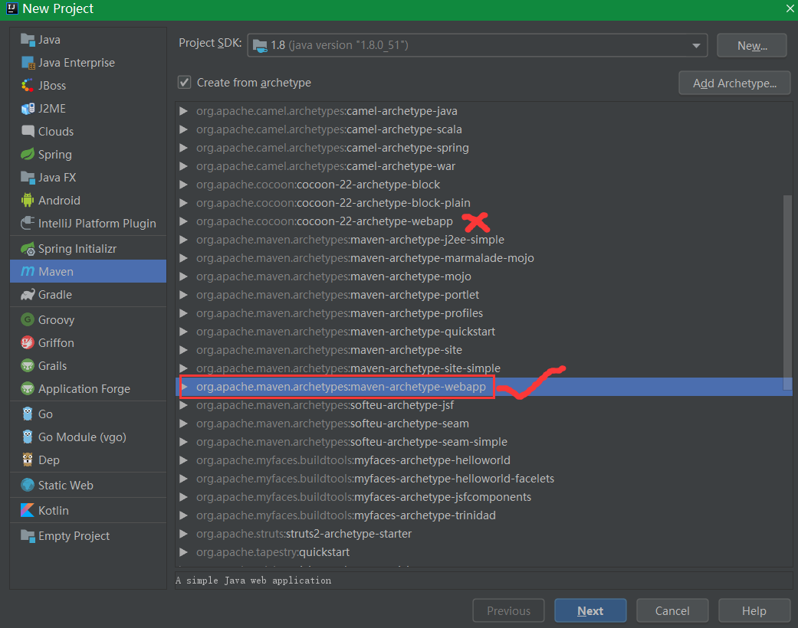
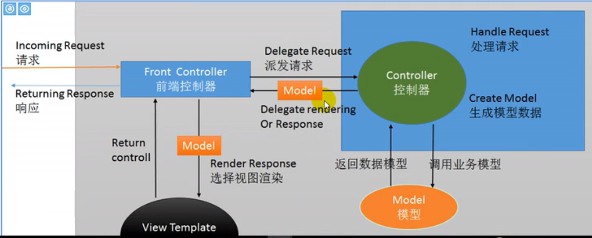
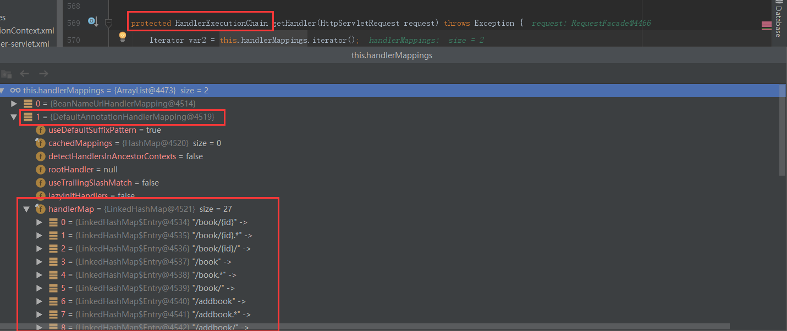
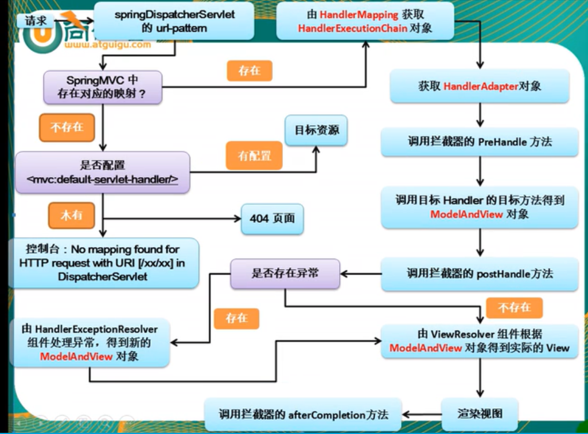
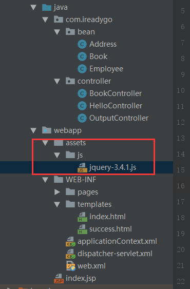

# 一、入门

## 1、基于maven创建SpringMVC工程




将下图中的Spring和Spring下的Spring MVC都勾上，之前配置pom.xml文件时，已经自动下载了spring相关文件，所以这里就直接用之前下载好的就可以了，OK。**（注意：点了Add framework support之后，在下图中有可能会找不到Spring，解决办法在下图的下方）**


如果在Add framework support中找不到Spring，那是因为项目中可能已经存在Spring相关文件，但不一定是完善的。因此我们要将已经存在的Spring给删掉，重新添加，方法如下：


点击File，选择Project Structure，选择Facets，就会看到有一个Spring啦，右击它，点删除就行啦，然后再回到上面第3步重新Add framework support，Spring就会出现啦。


原文链接：https://blog.csdn.net/weixin_42222334/article/details/80362126


## 2、MVC原理




# 二、请求

## 1、前端控制器：DispatcherServlet

```xml
<servlet>
    <servlet-name>dispatcher</servlet-name>
    <servlet-class>org.springframework.web.servlet.DispatcherServlet</servlet-class>

    <init-param>
         <!--contextConfigLocation：指定 SpringMVC 配置文件的位置，
			格式为 servlet的名字-servlet.xml -->
        <param-name>contextConfigLocation</param-name>
        <param-value>/WEB-INF/dispatcher-servlet.xml</param-value>
    </init-param>

    <load-on-startup>1</load-on-startup>
</servlet>

<!--
1、服务器的大 web.xml 中有一个 DefaultServlet是 url-pattern=/；
	静态资源默认由Tomcat DefaultServlet处理
2、我们配置的前端控制器的 <url-pattern>/</url-pattern>
    我们前端控制器就会禁掉 Tomcat服务器中的 DefaultServlet，
	静态资源就会被 DispatcherServlet拦截，查找RequestMapper是否匹配xxx.html
3、jsp 能访问，因为 / 不会拦截 *.jsp，不会覆盖服务器 JspServlet
4、/* 就是拦截所有请求，我们写 / 也是为了迎合 Rest API 风格
-->
<servlet-mapping>
    <servlet-name>dispatcher</servlet-name>
    <!-- / 拦截 *.jsp 之外的所有请求；/* 会拦截所有请求-->
    <url-pattern>/</url-pattern>
</servlet-mapping>
```

```java
@Controller
public class HelloController {

    @RequestMapping("/hello")
    public String hello(){
        System.out.println("收到请求...准备处理");
        //视图解析器自动拼串
        return "success";
    }
}
```

dispatcher-servlet.xml（SpringMVC配置文件）

```xml
<context:component-scan base-package="com.ireadygo"/>
<bean class="org.springframework.web.servlet.view.InternalResourceViewResolver">
    <property name="prefix" value="/WEB-INF/pages/"/>
    <property name="suffix" value=".jsp"/>
</bean>
```


## 2、页面发起PUT、DELETE请求

原理：**SpringMVC中有一个 Filter；它可以把普通的请求转化为规定形式的请求**

```xml
<filter>
    <filter-name>HiddenHttpMethodFilter</filter-name>
    <filter-class>org.springframework.web.filter.HiddenHttpMethodFilter</filter-class>
</filter>
<filter-mapping>
    <filter-name>HiddenHttpMethodFilter</filter-name>
    <!-- 拦截所有请求 -->
    <url-pattern>/*</url-pattern>
</filter-mapping>
```

```java
protected void doFilterInternal(HttpServletRequest request, HttpServletResponse response, FilterChain filterChain) throws ServletException, IOException {
    HttpServletRequest requestToUse = request;
    // 获取 form method 的值
    if ("POST".equals(request.getMethod()) && request.getAttribute("javax.servlet.error.exception") == null) {
        // 获取 input _method 的值
        String paramValue = request.getParameter(this.methodParam);
        if (StringUtils.hasLength(paramValue)) {
            // 转为 PUT、DELETE
            String method = paramValue.toUpperCase(Locale.ENGLISH);
            if (ALLOWED_METHODS.contains(method)) {
                requestToUse = new HiddenHttpMethodFilter.HttpMethodRequestWrapper(request, method);
            }
        }
    }

    filterChain.doFilter((ServletRequest)requestToUse, response);
}
```


步骤：

> 1、创建一个post类型的表单，表单项携带一个 _method 的参数，_method 值为 PUT、DELETE
>
> 2、
>
> 


```jsp
<a href="book/1">查询图书</a>
<form action="book" method="post">
    <input type="submit" value="添加图书">
</form>

<form action="book/1" method="put">
    <input type="submit" value="修改图书">
</form>

<form action="book/1" method="delete">
    <input type="submit" value="删除图书">
</form>
```

如果跳转后的jsp页面报错：405

添加：isErrorPage="true"

```jsp
<%@ page contentType="text/html;charset=UTF-8" language="java" isErrorPage="true" %>
```

## 3、请求参数

1）、@PathVariable("id")：获取路径参数

```java
@RequestMapping(value = "/book/{id}", method = RequestMethod.GET)
public String getBook(@PathVariable("id") Integer id) {
    System.out.println("查询第 " + id + " 号图书");
    return "success";
}
```

2）、**@RequestParam（）：获取请求参数，<span style="color:red">包括表单参数</span>**

但是请求处理方法如果使用的POJO对象处理，而表单没有传递相关属性，**会有null覆盖问题，使用@ModelAttribute解决**

3）@RequestHeader：获取请求头信息

@CookieValue("JSESSIONID")：获取 Cookie 信息，**如果没有指定参数值会报错，可以使用 required=false**

```java
@RequestMapping(value = "/header")
public String header(@RequestHeader("User-Agent") String userAgent, @CookieValue("JSESSIONID") String sessionId){
    System.out.println("userAgent: "+userAgent);
    System.out.println("sessionId: "+sessionId);
    return "success";
}
```


## 4、请求参数 POJO 处理

SpringMVC 会自动为这个 POJO 进行赋值

> 1、将 POJO 中的每一个属性，从 request 参数中尝试获取出来，并封装即可；
>
> 2、还可以级联封装

```java
public class Book {

    private String bookName;
    private String author;
    private Double price;
    private Integer stock;
    private Integer sales;
    private Address address;

    public Book(){

    }
	.......
   
}

public class Address {

    private String province;
    private String city;
    private String street;

	......
}

```

```html
<h1>测试POJO</h1>
<form action="addbook" method="post">
    书名：<input type="text" name="bookName"><br>
    作者：<input type="text" name="author"><br>
    价格：<input type="text" name="price"><br>
    库存：<input type="text" name="stock"><br>
    销量：<input type="text" name="sales"><br>
    <hr>
    省：<input type="text" name="address.province"><br>
    市：<input type="text" name="address.city"><br>
    街道：<input type="text" name="address.street"><br>
    <input type="submit" value="提交查询内容">

</form>
```

```java
@RequestMapping(value = "/addbook",method = RequestMethod.POST)
public String addBook(Book book){
    System.out.println("保存图书："+book);
    return "success";
}
```

保存图书：Book{bookName='Java', author='xiaolin', price=100.0, stock=1, sales=20, address=Address{province='?????????', city='?·±??????', street='?????????'}}


### 4.1、解决 POST请求乱码

1）web.xml中添加 Filter；<span style="color:red">**必须放在所有 Filter前面，否则仍然乱码**</span>

**原因是 HiddenHttpMethodFilter 调用了**：String paramValue = request.getParameter(this.methodParam);

```xml
<!-- 配置一个字符编码的 Filter-->
<filter>
    <filter-name>CharacterEncodingFilter</filter-name>
    <filter-class>org.springframework.web.filter.CharacterEncodingFilter</filter-class>
    <!-- 解决 POST 请求乱码 request.setCharacterEncoding(encoding);-->
    <init-param>
        <param-name>encoding</param-name>
        <param-value>UTF-8</param-value>
    </init-param>
    <init-param>
        <param-name>forceRequestEncoding</param-name>
        <param-value>true</param-value>
    </init-param>
    <!-- 顺手解决响应乱码 response.setCharacterEncoding(encoding);-->
    <init-param>
        <param-name>forceResponseEncoding</param-name>
        <param-value>true</param-value>
    </init-param>
</filter>
<filter-mapping>
    <filter-name>CharacterEncodingFilter</filter-name>
    <url-pattern>/*</url-pattern>
</filter-mapping>
```

web application directory [F:\01_apache-tomcat-9.0.13\webapps\manager] has finished in [69] ms
保存图书：Book{bookName='Java', author='xiaolin', price=100.0, stock=1, sales=20, address=Address{province='广东省', city='深圳市', street='宝安区'}}

## 5、请求参数中使用原生 API


# 三、数据输出

## 1、Map

### 1.1 引入 Thymeleaf模板引擎

```xml
<!-- https://mvnrepository.com/artifact/org.thymeleaf/thymeleaf -->
<dependency>
    <groupId>org.thymeleaf</groupId>
    <artifactId>thymeleaf</artifactId>
    <version>3.0.11.RELEASE</version>
</dependency>

<!-- https://mvnrepository.com/artifact/org.thymeleaf/thymeleaf-spring4 -->
<dependency>
    <groupId>org.thymeleaf</groupId>
    <artifactId>thymeleaf-spring4</artifactId>
    <version>3.0.11.RELEASE</version>
</dependency>
```

配置模板引擎

```xml
<!-- 注释掉JSP视图解析器配置 -->
<!--<bean class="org.springframework.web.servlet.view.InternalResourceViewResolver">-->
<!--<property name="prefix" value="/WEB-INF/pages/"/>-->
<!--<property name="suffix" value=".jsp"/>-->
<!--</bean>-->

<!-- 使用 Thymeleaf 解析器-->
<bean id="templateResolver" class="org.thymeleaf.spring4.templateresolver.SpringResourceTemplateResolver">
    <property name="prefix" value="/WEB-INF/templates/"/>
    <property name="suffix" value=".html"/>
    <property name="templateMode" value="HTML5"/>
    <!-- 解决 html 静态页面中文乱码-->
    <property name="characterEncoding" value="UTF-8"/>
</bean>
<bean id="templateEngine" class="org.thymeleaf.spring4.SpringTemplateEngine">
    <property name="templateResolver" ref="templateResolver"/>
</bean>
<!-- 视图解析器配置 -->
<bean class="org.thymeleaf.spring4.view.ThymeleafViewResolver">
    <property name="templateEngine" ref="templateEngine"/>
    <!-- 解决页面获取 map 数据乱码问题 -->
    <property name="characterEncoding" value="UTF-8"/>
    <property name="order" value="1"/>
</bean>
```


```java
@RequestMapping(value = "/map")
    public String map(Map<String, Object> map) {
        map.put("msg", "你好，小林");

        System.out.println("map类型："+map.getClass());
        return "success";
    }
```

map类型：class org.springframework.validation.support.BindingAwareModelMap

页面显示

```html
<html lang="en" xmlns:th="http://www.thymeleaf.org">
<head>
    <meta charset="UTF-8">
    <title>Title</title>
</head>
<body>
<p th:text="${msg}"></p>
```


## 2、请求域保存数据 

Model 和 ModelMap 类似

```java
@RequestMapping(value = "/model")
public String model(Model model) {
    model.addAttribute("msg", "今天天气真好");

    System.out.println("model类型："+model.getClass());
    return "success";
}
```

model类型：class org.springframework.validation.support.BindingAwareModelMap


ModelAndView类似：

```java
@RequestMapping("/modelandview")
public ModelAndView modelAndView(){
    ModelAndView modelAndView = new ModelAndView("success");
    modelAndView.addObject("msg","hahaha");
    return modelAndView;
}
```


总结：

Map，Model，ModelMap：最终都是 BindingAwareModelMap在工作；

相当于给 BindingAwareModelMap 中保存的东西都会被放在**请求域**（**request**）中；


## 2、@SessionAttributes：（推荐使用原生API）

**@SessionAttributes不推荐了，容器发生异常**

给BindingAwareModelMap 中保存的数据，或者ModelAndView中的数据，同时给 session 中放一份；

value指定保存数据时 session中保存的数据的 key；可以使用 type={String.class} 指定保存的数据类型

```java
@SessionAttributes(value = {"msg"})
@Controller
public class OutputController {
    ......
}
```

```html
<p th:text="${msg}"></p>
<p th:text="${session.msg}"></p>
```

## 3、@ModelAttribute原理

**问题：如果页面没有传递数据，全更新时会将 null 值覆盖数据库中的对应数据**

```java
/**
     * 1）SpringMVC 要封装请求的 Book 对象不应该是自己 new 出来的，而应该是从【数据库】中拿到准备好的对象
     * 2）再来使用这个对象封装请求参数
     * <p>
     * 此方法在目前方法之前执行，可以获取数据库中的数据
     * 将图书信息保存起来
     */
@ModelAttribute
public void handleModelAttribute(Map<String, Object> map) {
    Book book = new Book("西游记", "xiaoyun", 100.0, 2, 10);
    map.put("book", book);
    System.out.println("modelattribute 方法 ------ 数据库中的 book 对象：" + book);
}

/**
     *  告诉 SpringMVC 不要 new Book 对象了，我刚才已经保存了一个 book；
     *  那个book就是从数据库查出来的，用我这个book
     * @param book
     * @return
     */
@RequestMapping(value = "/updateBook",method = RequestMethod.POST)
public String updateBook(@ModelAttribute("book") Book book) {
    System.out.println("页面提交过来的图书信息：" + book);
    return "success";
}
```

```html
<form action="updateBook" method="post">
    书名：<input type="text" value="西游记" readonly><br>
    作者：<input type="text" name="author"><br>
    价格：<input type="text" name="price"><br>
    库存：<input type="text" name="stock"><br>
    销量：<input type="text" name="sales"><br>

    <input type="submit" value="提交查询内容">
</form>
```

modelattribute 方法 ------ 数据库中的 book 对象：Book{bookName='西游记', author='xiaoyun', price=100.0, stock=2, sales=10, address=null}
页面提交过来的图书信息：Book{bookName='西游记', author='aaa', price=100.0, stock=1, sales=20, address=null}

说明：页面没有传递 bookName对象，应该为null，但是使用了@ModelAttribute，我们优先创建book对象保存到 **BindingAwareModelMap**中，请求方法拿到保存的 book 对象后，对页面没有传递的 null 数据进行更新


# 四、源码分析

## 1、前端控制器 DispatcherServlet

```java
protected void doDispatch(HttpServletRequest request, HttpServletResponse response) throws Exception {
    // 1、根据当前的请求地址找到哪个类能处理（Controller）：没有找到404或者抛出异常
    // HandlerExecutionChain with handler [com.ireadygo.controller.OutputController@52955e9e] and 1 interceptor
    // Determine handler for the current request.
    HandlerExecutionChain mappedHandler = getHandler(processedRequest);
    
    // 2、拿到能执行这个类所有方法的适配器：（反射工具，AnnotationMethodHandlerAdapter）
    // Determine handler adapter for the current request.
    HandlerAdapter ha = getHandlerAdapter(mappedHandler.getHandler());

    if (!mappedHandler.applyPreHandle(processedRequest, response)) {
        return;
    }
    
    
    // Actually invoke the handler. mappedHandler.getHandler()就是Controller
    // 控制器（Controller），处理器（Handler）
    // 3、适配器来执行目标方法：将目标方法执行完成后的返回值作为视图名，保存到ModelAndView
    // 目标方法无论怎么写，适配器都会将执行后的信息封装成 ModelAndView
    mv = ha.handle(processedRequest, response, mappedHandler.getHandler());
    
    mappedHandler.applyPostHandle(processedRequest, response, mv);
    
    
    // 转发到目标页面
    // 4、根据方法最终执行完成后封装的ModelAndView；转发到对应页面，而且ModelAndView中的数据可以从请求域中获取
    processDispatchResult(processedRequest, response, 
                          mappedHandler, mv, dispatchException);
}
```

总结：

> 1、所有请求过来 DispatcherServlet收到请求
>
> 2、调用 doDispatcher（）方法进行处理
>
> ​		1）、getHandler（）：根据当前请求地址找到能处理这个请求的目标处理器类（处理器），根据当前请求在 HandlerMapping中找到这个请求的映射信息，获取到目标处理类
>
> ​		2）、getHandlerAdapter（）：根据当前处理器类获取到能执行这个处理器方法的适配器，根据当前处理器类，找到当前类的 HandlerAdapter（适配器）
>
> ​		3）、使用刚才获取到的适配器（AnnotationMethodHandlerAdapter）执行目标方法
>
> ​		4）、目标方法执行后会返回一个 ModelAndView对象
>
> ​		5）、根据 ModelAndView 的信息转发到具体的页面，并可以在请求域中取出 ModelAndView中的模型数据

## 2、getHandler(processedRequest)细节

怎么根据当前请求找到哪个类处理

getHandler（）会返回目标处理器类的执行链；

HandlerMapping：处理器映射，它里面保存了每一个处理器能处理哪些请求的映射信息

HandlerMap：IOC容器启动创建 Controller 对象的时候扫描每个处理器都能处理什么请求，保存在 HandlerMap 属性中国，下一次请求过来，就来看哪个HandlerMapping中有这个请求就行了

```java
protected HandlerExecutionChain getHandler(HttpServletRequest request) throws Exception {
    for (HandlerMapping hm : this.handlerMappings) {
        if (logger.isTraceEnabled()) {
            logger.trace(
                "Testing handler map [" + hm + "] in DispatcherServlet with name '" + getServletName() + "'");
        }
        HandlerExecutionChain handler = hm.getHandler(request);
        if (handler != null) {
            return handler;
        }
    }
    return null;
}
```




## 3、HandlerAdapter

如何找到目标处理器类的适配器。**要拿适配器才去执行目标方法**

AnnotationMethodHandlerAdapter：能解析注解方法的适配器；处理器类中只要有标了注解的这些方法就能用

```java
protected HandlerAdapter getHandlerAdapter(Object handler) throws ServletException {
    for (HandlerAdapter ha : this.handlerAdapters) {
        if (logger.isTraceEnabled()) {
            logger.trace("Testing handler adapter [" + ha + "]");
        }
        if (ha.supports(handler)) {
            return ha;
        }
    }
    throw new ServletException("No adapter for handler [" + handler +
                               "]: The DispatcherServlet configuration needs to include a HandlerAdapter that supports this handler");
}

public final boolean hasHandlerMethods() {
    return !this.handlerMethods.isEmpty();
}
```

**AnnotationMethodHandlerAdapter** implements HandlerAdapter

```java
@Override
public ModelAndView handle(HttpServletRequest request, HttpServletResponse response, Object handler)
    throws Exception {
    .....
        return invokeHandlerMethod(request, response, handler); 
}

protected ModelAndView invokeHandlerMethod(HttpServletRequest request, HttpServletResponse response, Object handler)
    throws Exception {

    ServletHandlerMethodResolver methodResolver = getMethodResolver(handler);
    Method handlerMethod = methodResolver.resolveHandlerMethod(request);
    ServletHandlerMethodInvoker methodInvoker = 
        new ServletHandlerMethodInvoker(methodResolver);
    ServletWebRequest webRequest = new ServletWebRequest(request, response);
    
    // 创建隐含模型
    ExtendedModelMap implicitModel = new BindingAwareModelMap();
    // 真正执行目标方法
    Object result = methodInvoker
        .invokeHandlerMethod(handlerMethod, handler, webRequest, implicitModel);
    
ModelAndView mav = methodInvoker.getModelAndView(
        handlerMethod, handler.getClass(), result, implicitModel, webRequest);
    methodInvoker.updateModelAttributes(handler, (mav != null ? mav.getModel() : null), implicitModel, webRequest);
    return mav;
}
```

## 4、页面渲染

```java
processDispatchResult(){
    ......
        this.render(mv, request, response);
}
```


## 5、DispatcherServlet 九大组件

组件共同点：九大组件都是接口

```java
public class DispatcherServlet extends FrameworkServlet {

    /** 文件上传解析器 */
    private MultipartResolver multipartResolver;

    /** 区域信息解析器：和国际化有关 */
    private LocaleResolver localeResolver;

    /** 主体解析器：强大的主体效果更换 */
    private ThemeResolver themeResolver;

    /** Handler映射信息 */
    private List<HandlerMapping> handlerMappings;

    /** Handler的适配器 */
    private List<HandlerAdapter> handlerAdapters;

    /** SpringMVC强大的异常解析功能：异常解析器 */
    private List<HandlerExceptionResolver> handlerExceptionResolvers;

    /**  */
    private RequestToViewNameTranslator viewNameTranslator;

    /** 运行重定向携带数据的功能 */
    private FlashMapManager flashMapManager;

    /** 视图解析器 */
    private List<ViewResolver> viewResolvers;

    .....
}
```

九大组件初始化

onRefresh：为Spring 容器初始化时调用的

```java
@Override
protected void onRefresh(ApplicationContext context) {
    initStrategies(context);
}

protected void initStrategies(ApplicationContext context) {
    initMultipartResolver(context);
    initLocaleResolver(context);
    initThemeResolver(context);
    initHandlerMappings(context);
    initHandlerAdapters(context);
    initHandlerExceptionResolvers(context);
    initRequestToViewNameTranslator(context);
    initViewResolvers(context);
    initFlashMapManager(context);
}
```

组件的初始化：

有些组件在容器中是使用类型找的，有些是使用id找的；找不到用默认值


## 6、执行目标方法

确定方法每个参数的值

1）标注解：保存注解的信息，最终得到这个注解应该对应解析的值

2）没标注解：

> 1、看是否是原生 API
>
> 2、看是否是Model或者是 Map，xxx
>
> 3、都不是，看是否是简单类型；paramName；
>
> 4、给attrName赋值；attrName（参数标了@ModelAttribute("")就是制定了，没标就是“”）
>
> ​	确定自定义类型参数：
>
> ​	1）attrName 使用参数的类型首字母小写；或者使用之前 @ModelAttribute("")的值
>
> ​	2）先看隐含模型中有每个 attrName 作为key对应的值；如果有就从隐含模型中获取并赋值
>
> ​	3）看是否是 @SessionAttribute（value=“haha”）；标注的属性，如果是从 session中拿；不过拿不到就会抛出异常
>
> ​	4）不是@SessionAttribute标注的，利用反射创建一个对象
>
> ​	5）拿到之前创建好的对象，使用数据绑定器（WebDataBinder）将请求中的每个数据绑定到这个对象中

@ModelAttribute标注的方法：缺点，所有请求都会提前执行此方法


# 五、视图解析

## 1、forward 与 redirect

转发，不会拼接路径

> forward:转发的路径

重定向

> redirect:重定向的路径（如 redirect:/emps）
>
> /hello.jsp：代表就是从当前项目下开始；SpringMVC会为路径自动的拼接上项目名
>
> 原生的 Servlet重定向 /路径+项目名才能成功
>
> response.sendRedirect("/hello.jsp") （会失败）


## 2、静态资源与动态资源访问问题

```xml
<!--请求直接直接映射一个页面，没有业务逻辑-->
<mvc:view-controller path="/viewcontroller" view-name="success"/>


<!--默认前端控制器拦截所有请求（除jsp外），js 文件就会404，要js文件提交给Tomcat处理-->
<!--告诉SPringMVC，自己能够处理的请求自己处理，不能处理的请求交给Tomcat处理-->
<!--静态资源能访问了，但动态资源又不行了，需要加上 <mvc:annotation-driven></mvc:annotation-driven> -->
<mvc:default-servlet-handler/>

<!--必须添加这个，SpringMVC可以保证静态资源和动态资源都能访问-->
<mvc:annotation-driven></mvc:annotation-driven>
```

 # 六、解决 Restful 问题

## 1、PUT

1）进入修改页面，根据id，查出数据进行回显

```html
<td>
    <a href="${ctp}/emp/${emp.id}">edit</a>
</td>
```

```java
@RequestMapping(value="/emp/{id}", method=RequestMethod.GET)
public String getEmp(@PathVariable("id") Integer id, Model model){
    //1、查出员工信息
    Employee employee = employeeDao.get(id);
    //2、放在请求域中
    model.addAttribute("employee", employee);
    //3、继续查出部分信息放在隐含模型中
    .....
    model.addAttribute("depts",departments);
    
    return "edit"
}
```

编辑页面携带隐藏域

```html
<form action="/emp/id" method="post">
    <input type="hidden" name="_method" value="PUT">
    <input type="hidden" name="id" value="${employee.id}">  
    可以通过@RequestParam获取表单参数的值
    
    其它表单数据填充
    ......
    
</form>
```

2）修改请求

```java
// 不能使用@PathVariable("id")，因为所有请求都会执行此注解标注方法，可能没有携带 id
@ModelAttribute
public void myModelAttribute(@RequestParam(value="id",required=false) Integer id){  
    if(id != null){
        Employee employee = employeeDao.get(id);
        model.addAttribute("depts", departments); // 将数据放到隐含域中
    }
}

// // 取出隐含域中的 employee 对象
@RequestMapping(value="/emp/{id}", method=RequestMethod.PUT)
public Strinjg updateEmp(@ModelAttribute("employee") Employee employee){
    employeeDao.save(employee);
    
    return "redicrect:/emps";
}
```


## 2、DELETE

使用jQuery

```html
<a href="/emp/id"></a>

<form id="deleteForm" action="${ctp}/emp/${emp.id}" method=post>
    <input type="hidden" name="_method" value="DELETE">
</form>

<script type="text/javascript">
    $(function(){
        $(".delBtn").click(function(){
            // 1.改变表单的action地址
            $("#deleteForm").attr("action",this.href);
            // 2.提交表单
            $("#deleteForm").submit();
            
            return false;
        })
    })
</script>
```


# 七、JSON相关

@JsonIgnore：忽略返回的字段

@JsonFormat（pattern="yyyy-MM-dd"）


## 1、AJAX：get

```javascript
<a th:href="@{/emps}">获取所有员工</a>
<script th:src="@{/assets/js/jquery-3.4.1.js}"></script>
<script type="text/javascript">
    $("a.ajaxGet").click(function () {
    var user = {
        username:"xiaolin",
        password: 100
    };
    $.ajax({
        url: $("a.ajaxGet").attr("href"),
        type: "GET",
        data: user, // 绝对不能 JSON.stringify(user)；ajax会自动转为 k1=v1&k2=v2
        success: function (data) {
            console.log("data: " + JSON.stringify(data));
        }
    });
    return false; // 禁止默认行为，可以防止跳转
});
</script>
```

**@ResponseBody：可以把对象转为 json 数据，返回给浏览器**

SpringMVC自动将Get请求参数封装为对象，**如果使用@RequestParam只能获取单个参数**

```java
@ResponseBody
@RequestMapping("/ajaxGet")
public List<Employee> ajaxGet(User user) {
    System.out.println("AJAX -- GET: user=" + user);
    List<Employee> employeeList = new ArrayList<Employee>();
    Employee employee = new Employee("xiaolin", 20);
    Employee employee1 = new Employee("xiaoyun", 18);
    employeeList.add(employee);
    employeeList.add(employee1);
    return employeeList;
}
```

问题：

org.springframework.web.util.NestedServletException: Request processing failed; nested exception is java.lang.IllegalArgumentException: No converter found for return value of type: class java.util.ArrayList

**SpringMVC 中使用 @ResponseBody 返回Json时，需要手动添加jackson依赖**

```xml
<dependency>
  <groupId>com.fasterxml.jackson.core</groupId>
  <artifactId>jackson-core</artifactId>
  <version>2.8.7</version>
</dependency>
<dependency>
  <groupId>com.fasterxml.jackson.core</groupId>
  <artifactId>jackson-databind</artifactId>
  <version>2.8.7</version>
</dependency>
```

@ResponseBody：直接将数据返回给浏览器（会解析标签）

```java
@ResponseBody
@RequestMapping("/rb")
public String reponseBody() {
    return "<h1>success</h1>";
}
```


## 2、AJAX：post

```javascript
// AJAX提交的 post 请求,请求头默认为：Content-Type: application/x-www-form-urlencoded; charset=UTF-8

$("a.ajaxPost").click(function () {
    $.ajax($("a.ajaxPost").attr("href"), {
        type: "POST",
        data: emp, // 必须转为 json 串，否则报400
        // contentType: "application/json", // 未指定，默认为 application/x-www-form-urlencoded（请求数据编码）
        dataType: "json",  // 服务器返回的数据类型，默认根据响应头
        success: function (data) {

            console.log("data1: " + typeof data);
            console.log(JSON.stringify(data));
        }
    });
    return false;
});
```

不需要注解接收参数

```java
@ResponseBody
@RequestMapping(value = "/ajaxPost")
public Employee ajaxPost(Employee employee) {
    System.out.println("employee: " + employee);
    return employee;
}
```


## 3、AJAX：post + @RequestBody

**<span style="color:red">注意：必须是 post 请求；常用其来处理application/json类型</span>**

如果使用@RequestBody 注解，ajax必须添加如下两步：

**<span style="color:red">1、data: JSON.stringify(emp)    // 必须转为 json 串</span>**

**<span style="color:red">2、contentType: "application/json",  // 指定客户端请求数据类型</span>**

```javascript
var empWithContentType = {
    name: "abc",
    age: 28
};
// AJAX提交的 post 请求，Content-Type: application/json
$("a.ajaxPostRes").click(function () {
    $.ajax($("a.ajaxPostRes").attr("href"), {
        type: "POST",
        data: JSON.stringify(empWithContentType), // 必须转为 json 串，否则报400
        contentType: "application/json", // 设置请求头，即指定请求数据的编码格式
        dataType: "json",  // 服务器返回的数据类型
        success: function (data) {

            console.log("data1: " + typeof data);
            console.log(JSON.stringify(data));
        }
    });
    return false;
});
```

```java
// 如果是AJAX提交 post请求，参数字符串化了，必须使用@RequestBody
@ResponseBody
@RequestMapping(value = "/ajaxPostRes")
public Employee ajaxPostResponseBody(@RequestBody Employee employee) {
    System.out.println("employee: " + employee);
    return employee;
}
```

可能遇到的错误码：

Status Code: 415  ，没有指定AJAX提交的请求数据类型

400：post 请求时请求数据没有转为 json 串

问题：

>  正常的post请求(不包括ajax请求)在http头中的 content-type 为 application/x-www-form-urlencoded ,这时在java后台可以通过request.getParameter(name)的形式获取.但是通过原生ajax请求时,在java后台通过request.getParameter(name)的形式却无法获取到传入的参数.
>
> 原因是原生ajax请求时,在http头中的content-type为text/plain;charset=UTF-8.当请求到达tomcat服务器时,服务器只对application/x-www-form-urlencoded形式的http,post请求进行读取body体中的参数,并放到request的parameter中,对于原生ajax请求则直接忽略,不会读取body体中的参数,才导致request.getParameter(name)读取不到参数.
>
> 根据上面的分析结合自己的当前系统，发现系统封装的ajax默认content-type为application/json，那么这种方式在java后台通过request.getParameter(name)的形式是不能获取到传入的参数的！


## 4、@RequestBody接收表单参数

**默认不用注解，使用JavaBean就可以**

> @RequestParam：用来处理Content-Type: 为 application/x-www-form-urlencoded编码的内容

```html
<p>@RequestBody请求体测试</p>
<form th:action="@{requestbody}" method="post">
    用户名：<input type="text" name="username"><br>
    密码：<input type="text" name="password"><br>
    <input type="submit" value="提交">
</form>
```

**虽然使用的是表单请求，但服务器使用 String 类型接收数据，如果使用对象就会失败**

```java
@RequestMapping("/requestbody")
public String requestBody(@RequestBody String body) {
    System.out.println("body: " + body);
    return "success";
}
```

打印结果：body: username=xiaolin&password=123456


## 5、ResponseEntity：自定义header和body

****

```java
@RequestMapping("/responseEntity")
public ResponseEntity<String> responseEntity() {
    String body = "<h1>success</h1>";
    MultiValueMap headers = new HttpHeaders();
    headers.add("Set-Cookie", "useraname=xiaolin");
    return new ResponseEntity<String>(body, headers, HttpStatus.OK);
}
```

Content-Type: text/html;charset=UTF-8

Date: Wed, 23 Oct 2019 06:10:25 GMT

Set-Cookie: useraname=xiaolin


## 6、ResponseEntity：下载文件

```java
@RequestMapping("/download")
public ResponseEntity<byte[]> download(HttpServletRequest request) throws IOException {

    String filePath = "assets/js/jquery-3.4.1.js";
    ServletContext context = request.getServletContext();
    String realPath = context.getRealPath(filePath);
    System.out.println("realPath: " + realPath);
    FileInputStream in = new FileInputStream(realPath);
    byte[] body = new byte[in.available()]; // 这一行代码就可以了

    in.read(body); // 不需要也可以下载文件
    in.close();

    MultiValueMap<String, String> headers = new HttpHeaders();
    headers.add("Content-Disposition", "attachment;filename=" + "jquery-3.4.1.js");
    return new ResponseEntity<>(body, headers, HttpStatus.OK);
}
```

realPath: G:\01_SpringBoot_Project\SpringMVC_Study\target\SpringMVC_Study\assets\js\jquery-3.4.1.js


# 八、文件上传、下载

## 1、单文件上传

1）添加依赖

```xml
<!-- https://mvnrepository.com/artifact/commons-fileupload/commons-fileupload -->
<dependency>
    <groupId>commons-fileupload</groupId>
    <artifactId>commons-fileupload</artifactId>
    <version>1.3.1</version>
</dependency>
```

2）配置文件上传解析器

```xml
<!--配置文件上传解析器，id必须为 multipartResolver-->
<bean id="multipartResolver" class="org.springframework.web.multipart.commons.CommonsMultipartResolver">
    <property name="maxUploadSize" value="#{1024*1024*20}"/>
    <property name="defaultEncoding" value="utf-8"/>
</bean>
```

3）上传

```html
<p>测试文件上传</p>
<form th:action="@{/uploadFile}" method="post" enctype="multipart/form-data">
    用户头像：<input type="file" name="headerimg"><br>
    用户名称：<input type="text" name="username"><br>
    <input type="submit"/>
</form>

<p th:text="${msg}"></p>
```

4）处理上传请求

```java
@RequestMapping("/uploadFile")
public String upload(String username, @RequestParam("headerimg") MultipartFile multipartFile, Model model) {

    System.out.println("fileName: " + multipartFile.getName());
    System.out.println("originalName: " + multipartFile.getOriginalFilename());

    File file = new File("G:\\upload\\" + multipartFile.getOriginalFilename());
    try {
        multipartFile.transferTo(file);
        model.addAttribute("msg", "上传 success");
    } catch (IOException e) {
        e.printStackTrace();
        model.addAttribute("msg", "上传 fail");
    }

    return "success";
}
```

打印：

fileName: headerimg
**originalName: QQ图片20191018143319.jpg**


## 2、多文件上传

```html
<p>测试多文件上传</p>
<form th:action="@{/uploadManyFile}" method="post" enctype="multipart/form-data">
    用户头像1：<input type="file" name="headerimg"><br>
    用户头像2：<input type="file" name="headerimg"><br>
    用户头像3：<input type="file" name="headerimg"><br>
    用户头像4：<input type="file" name="headerimg"><br>
    用户名称：<input type="text" name="username"><br>
    <input type="submit"/>
</form>
```

```java
@RequestMapping("/uploadManyFile")
public String upload(String username, @RequestParam("headerimg") MultipartFile[] multipartFiles, Model model) {

    for (MultipartFile multipartFile : multipartFiles) {
        if(!multipartFile.isEmpty()){
            File file = new File("G:\\upload\\" + multipartFile.getOriginalFilename());
            try {
                System.out.println("fileName: " + multipartFile.getName());
                System.out.println("originalName: " + multipartFile.getOriginalFilename());

                multipartFile.transferTo(file);
                model.addAttribute("msg", "上传 成功了");
            } catch (IOException e) {
                e.printStackTrace();
                model.addAttribute("msg", "上传 失败了");
            }
        }
    }
    return "success";
}
```


# 九、拦截器

## 1、HandlerInterceptor

```java
// 在目标方法运行之前调用；return true（chain.doFilter（）放行）；return false；不放行
boolean preHandle(HttpServletRequest request, HttpServletResponse response
, Object handler)throws Exception;

// 在目标方法运行之后调用：
void postHandle(HttpServletRequest request, HttpServletResponse response
, Object handler, ModelAndView modelAndView)throws Exception;

// 在整个请求完成之后，来到目标页面之后；chain.doFilter（）放行，资源响应之后
void afterCompletion(HttpServletRequest request,HttpServletResponse response
,Object handler, Exception ex)throws Exception;
```

1）创建拦截器

```java
public class MyInterceptor implements HandlerInterceptor {
    @Override
    public boolean preHandle(HttpServletRequest request, HttpServletResponse response, Object handler) throws Exception {
        System.out.println("MyInterceptor .....preHandle");
        return true;
    }

    @Override
    public void postHandle(HttpServletRequest request, HttpServletResponse response, Object handler, ModelAndView modelAndView) throws Exception {
        System.out.println("MyInterceptor....postHandle,"+modelAndView.getViewName());
    }

    @Override
    public void afterCompletion(HttpServletRequest request, HttpServletResponse response, Object handler, Exception ex) throws Exception {
        System.out.println("MyInterceptor.....afterCompletion");
    }
}
```

2）配置拦截器

```xml
<!-- 配置拦截器 -->
<mvc:interceptors>
    <!--默认拦截所有请求-->
    <bean class="com.ireadygo.interceptor.MyInterceptor"/>

    <!--<mvc:interceptor>-->
    <!--只拦截 interceptor 请求-->
    <!--<mvc:mapping path="/interceptor"/>-->
    <!--<bean class="com.ireadygo.interceptor.MyInterceptor"/>-->
    <!--</mvc:interceptor>-->
</mvc:interceptors>
```

3）处理请求

```java
@RequestMapping("/interceptor")
public String myInterceptor() {
    System.out.println("执行 myInterceptor 目标方法");
    return "success";
}
```

打印：

MyInterceptor .....preHandle
执行 myInterceptor 目标方法
MyInterceptor.....postHandle,success
MyInterceptor.....afterCompletion


**正常的运行流程：**

**拦截器的preHandle----目标方法---拦截器postHandle----页面----拦截器的afterCompletion**

其它的流程：

1）、只要 preHandle 不放行就没有以后的流程；

2）、只要放行了，afterCompletion都会执行

## 2、多个拦截器

```xml
<!-- 配置拦截器 -->
<mvc:interceptors>
    <!--默认拦截所有请求-->
    <bean class="com.ireadygo.interceptor.MyFirstInterceptor"/>

    <mvc:interceptor>
        <mvc:mapping path="/interceptor"/>
        <bean class="com.ireadygo.interceptor.MySecondInterceptor"/>
    </mvc:interceptor>
</mvc:interceptors>
```

MyFirstInterceptor .....preHandle
MySecondInterceptor .....preHandle
执行 myInterceptor 目标方法
MySecondInterceptor.....postHandle,success
MyFirstInterceptor.....postHandle,success
MySecondInterceptor.....afterCompletion
MyFirstInterceptor.....afterCompletion

异常流程：

1、不放行

​	1）、哪一块不放行从此以后都没有；

​		MySecondInterceptor不放行；但是它前面已经放行的拦截的afterCompletion 总会执行

MyFirstInterceptor .....preHandle
MySecondInterceptor .....preHandle
MyFirstInterceptor.....afterCompletion

跟filter流程一样；

拦截器的preHandle：顺序执行

拦截器的postHandle：逆序执行

拦截器的afterCompletion：逆序执行 


## 3、静态资源被拦截问题

```xml
<!-- 配置拦截器 -->
<mvc:interceptors>
    <!--默认拦截所有请求-->

    <!--<bean class="com.ireadygo.interceptor.MyFirstInterceptor"/>-->

    <mvc:interceptor>
        <mvc:mapping path="/interceptor"/>
        <mvc:exclude-mapping path="/assets/js/**"/>
        <bean class="com.ireadygo.interceptor.MySecondInterceptor"/>
    </mvc:interceptor>
</mvc:interceptors>
```

也可以使用：<mvc:exclude-mapping path="/js/**"/>


## 4、源码分析：

```java
protected void doDispatch(HttpServletRequest request, HttpServletResponse response) throws Exception {
    try{
        HandlerExecutionChain mappedHandler = getHandler(processedRequest);

        HandlerAdapter ha = getHandlerAdapter(mappedHandler.getHandler());

        // 有一个拦截器返回false，目标方法以后都不会执行直接跳到afterCompletion
        if (!mappedHandler.applyPreHandle(processedRequest, response)) {
            return;
        }

        // Actually invoke the handler.适配器执行目标方法
        mv = ha.handle(processedRequest, response, mappedHandler.getHandler());
        ......

        applyDefaultViewName(processedRequest, mv);
        // 目标方法正常就会执行 applyPostHandle
        mappedHandler.applyPostHandle(processedRequest, response, mv);

        // 页面渲染；如果有异常直接跳到 afterCompletion
        processDispatchResult(processedRequest, response, mappedHandler,
                              mv, dispatchException);
    }catch (Exception ex) {
        triggerAfterCompletion(processedRequest, response, mappedHandler, ex);
    }
}


private void processDispatchResult(HttpServletRequest request, HttpServletResponse response,HandlerExecutionChain mappedHandler, 
                                   ModelAndView mv, Exception exception) throws Exception {
    .......
        render(mv, request, response);
    ......
        if (mappedHandler != null) {
            mappedHandler.triggerAfterCompletion(request, response, null);
        }
}

```

HandlerExecutionChain.java

```java
boolean applyPreHandle(HttpServletRequest request, HttpServletResponse response) throws Exception {
    HandlerInterceptor[] interceptors = getInterceptors();
    if (!ObjectUtils.isEmpty(interceptors)) {
        for (int i = 0; i < interceptors.length; i++) {
            HandlerInterceptor interceptor = interceptors[i];
            if (!interceptor.preHandle(request, response, this.handler)) {
                triggerAfterCompletion(request, response, null);
                return false;
            }
            // 记录放过的拦截器索引
            this.interceptorIndex = i;
        }
    }
    return true;
}

void applyPostHandle(HttpServletRequest request, HttpServletResponse response, ModelAndView mv) throws Exception {
    HandlerInterceptor[] interceptors = getInterceptors();
    if (!ObjectUtils.isEmpty(interceptors)) {
        //逆序执行
        for (int i = interceptors.length - 1; i >= 0; i--) {
            HandlerInterceptor interceptor = interceptors[i];
            interceptor.postHandle(request, response, this.handler, mv);
        }
    }
}

void triggerAfterCompletion(HttpServletRequest request, HttpServletResponse response, Exception ex)
    throws Exception {

    HandlerInterceptor[] interceptors = getInterceptors();
    if (!ObjectUtils.isEmpty(interceptors)) {
// 有记录最后一个放行的拦截器的索引，从它开始把之前所有放行的拦截器的afterCompletion都执行
        for (int i = this.interceptorIndex; i >= 0; i--) {
            HandlerInterceptor interceptor = interceptors[i];
            try {
                interceptor.afterCompletion(request, 
                                            response, this.handler, ex);
            }
            catch (Throwable ex2) {
                logger.error("HandlerInterceptor
                             .afterCompletion threw exception", ex2);
            }
        }
    }
}
```

拦截器方法执行顺序：

FirstInterceptor#preHandle----》HandlerAdapter#handle---》FirstInterceptor#postHandle

---》DispatcherServlet#render---》FirstInterceptor#afterCompletion


## 什么时候用Filter与Interceptor？

如果某些功能需要其它组件配合完成，就用拦截器（Interceptor只能在SpringMVC中使用）

其它情况可以用Filter（Servlet三大组件之一，Tomcat管理，无法注册到 spring IOC 容器中）


SpringMVC执行流程：

**1、所有请求，前端控制器（DispatcherServlet）收到请求，调用 doDispatch进行处理**

**2、根据 HandlerMapping 中保存的请求映射信息找到，处理当前请求的处理器执行链（包含拦截器）**

**3、根据当前处理器找到它的 HandlerAdapter（适配器）**

**4、拦截器的 preHandle 先执行**

**5、适配器执行目标方法**

​	1）、ModelAttribute 注解标注的方法提前运行

​	2）、执行目标方法的时候（确定目标方法用的参数）	

​	a. 有注解

​	b. 没注解

1. 看是否Model、Map以及其它类型

2. 如果是自定义类型

   1）、从隐含模型中看有没有，如果有就从隐含模型中拿

   2）、如果没有，再看是否 SessionAttribute标注的属性，如果从Session中拿，拿不到会抛出异常

   3）、都不是，就利用反射创建对象

**6、拦截器的 postHandle 执行**

**7、处理结果（页面渲染）**

​	1）如果有异常使用异常解析器处理异常；处理完后返回的还是 ModelAndView

​	2）调用 render 进行页面渲染

​			1）视图解析器根据视图名得到视图对象

​			2）视图对象调用 render 方法

**8、执行拦截器的 afterCompletion**




# 十、SpringMVC集成Spring

SpringMVC：配置和网站转发逻辑以及网站功能有关的（视图解析器，文件上传解析器，支持ajax，xxx）

Spring：配置和业务相关的（事务控制，数据源、xxx）

SpringMVC和Spring分容器

## 1、初步集成

1）、web.xml

```xml
<!--spring容器的配置文件-->
<context-param>
    <param-name>contextConfigLocation</param-name>
    <param-value>/WEB-INF/applicationContext.xml</param-value>
</context-param>

<servlet>
    <servlet-name>dispatcher</servlet-name>
    <servlet-class>org.springframework.web.servlet.DispatcherServlet</servlet-class>
    <!--SpringMVC配置文件-->
    <init-param>
        <param-name>contextConfigLocation</param-name>
        <param-value>/WEB-INF/dispatcher-servlet.xml</param-value>
    </init-param>

    <load-on-startup>1</load-on-startup>
</servlet>
```

2）、Spring IOC容器配置文件：applicationContext.xml（**优先启动**）

```xml
<?xml version="1.0" encoding="UTF-8"?>
<beans xmlns="http://www.springframework.org/schema/beans"
       xmlns:xsi="http://www.w3.org/2001/XMLSchema-instance"
       xmlns:context="http://www.springframework.org/schema/context"
       xsi:schemaLocation="http://www.springframework.org/schema/beans http://www.springframework.org/schema/beans/spring-beans.xsd http://www.springframework.org/schema/context http://www.springframework.org/schema/context/spring-context.xsd">

    <context:component-scan base-package="com.ireadygo"/>
</beans>
```


3）、SpringMVC配置文件：dispatcher-servlet.xml

```xml
<?xml version="1.0" encoding="UTF-8"?>
<beans xmlns="http://www.springframework.org/schema/beans"
       xmlns:xsi="http://www.w3.org/2001/XMLSchema-instance"
       xmlns:context="http://www.springframework.org/schema/context"
       xmlns:mvc="http://www.springframework.org/schema/mvc"
       xsi:schemaLocation="http://www.springframework.org/schema/beans http://www.springframework.org/schema/beans/spring-beans.xsd http://www.springframework.org/schema/context https://www.springframework.org/schema/context/spring-context.xsd http://www.springframework.org/schema/mvc http://www.springframework.org/schema/mvc/spring-mvc.xsd">

    <context:component-scan base-package="com.ireadygo">
    </context:component-scan>
</beans>    
```

4）、开发业务逻辑

```java
@Controller
public class BookController {

    public BookController(){
        System.out.println("BookController.....");
    }
}

@Service
public class BooService {

    public BooService() {
        System.out.println("BooService.....");
    }
}
```

启动服务器：**<span style="color:red">每个容器都打印了 BookController和BooService，说明被实例化了两次</span>**

```
24-Oct-2019 17:57:52.544 信息 [RMI TCP Connection(3)-127.0.0.1] org.springframework.beans.factory.xml.XmlBeanDefinitionReader.loadBeanDefinitions Loading XML bean definitions from ServletContext resource [/WEB-INF/applicationContext.xml]
BookController.....
BooService.....

24-Oct-2019 17:57:53.197 信息 [RMI TCP Connection(3)-127.0.0.1] org.springframework.beans.factory.xml.XmlBeanDefinitionReader.loadBeanDefinitions Loading XML bean definitions from ServletContext resource [/WEB-INF/dispatcher-servlet.xml]
BookController.....
BooService.....
```


## 2、解决组件实例化两次的问题

1）、修改Spring IOC容器配置文件：applicationContext.xml**（优先启动）**

```xml
<context:component-scan base-package="com.ireadygo">
    <context:exclude-filter type="annotation" expression=
                            "org.springframework.stereotype.Controller"/>
    <context:exclude-filter type="annotation" expression=                  		"org.springframework.web.bind.annotation.ControllerAdvice"/>
</context:component-scan>
```

2）、修改SpringMVC配置文件：dispatcher-servlet.xml，**只管理有@Controller和@ControllerAdvice注解**

```xml
<context:component-scan base-package="com.ireadygo" use-default-filters="false">
        <context:include-filter type="annotation" expression=
                                "org.springframework.stereotype.Controller"/>
        <context:include-filter type="annotation" expression="org.springframework.web.bind.annotation.ControllerAdvice"/>
    </context:component-scan>
```

启动服务器：都只实例化了一次

```
24-Oct-2019 18:08:20.356 信息 [RMI TCP Connection(3)-127.0.0.1] org.springframework.beans.factory.xml.XmlBeanDefinitionReader.loadBeanDefinitions Loading XML bean definitions from ServletContext resource [/WEB-INF/applicationContext.xml]
BooService.....

24-Oct-2019 18:08:21.051 信息 [RMI TCP Connection(3)-127.0.0.1] org.springframework.beans.factory.xml.XmlBeanDefinitionReader.loadBeanDefinitions Loading XML bean definitions from ServletContext resource [/WEB-INF/dispatcher-servlet.xml]
BookController.....
```


## 3、父子容器问题

```java
@Service
public class BooService {

    @Autowired
    BookController bookController;

    public BooService() {
        System.out.println("BooService.....");
    }
}
```

```
24-Oct-2019 18:14:37.683 信息 [RMI TCP Connection(3)-127.0.0.1] org.springframework.beans.factory.xml.XmlBeanDefinitionReader.loadBeanDefinitions Loading XML bean definitions from ServletContext resource 
[/WEB-INF/applicationContext.xml]
BooService.....

24-Oct-2019 18:14:38.198 警告 [RMI TCP Connection(3)-127.0.0.1] org.springframework.web.context.support.XmlWebApplicationContext.refresh Exception encountered during context initialization - cancelling refresh attempt: org.springframework.beans.factory.UnsatisfiedDependencyException: Error creating bean with name 'booService': Unsatisfied dependency expressed through field 'bookController'; nested exception is org.springframework.beans.factory.NoSuchBeanDefinitionException: No qualifying bean of type 'com.ireadygo.controller.BookController' available: expected at least 1 bean which qualifies as autowire candidate. Dependency annotations: {@org.springframework.beans.factory.annotation.Autowired(required=true)}
24-Oct-2019 18:14:38.200 严重 [RMI TCP Connection(3)-127.0.0.1] org.springframework.web.context.ContextLoader.initWebApplicationContext Context initialization failed
 org.springframework.beans.factory.UnsatisfiedDependencyException: Error creating bean with name 'booService': Unsatisfied dependency expressed through field 'bookController'; nested exception is org.springframework.beans.factory.NoSuchBeanDefinitionException: No qualifying bean of type 'com.ireadygo.controller.BookController' available: expected at least 1 bean which qualifies as autowire candidate. Dependency annotations: {@org.springframework.beans.factory.annotation.Autowired(required=true)}

```


因为Spring IOC容器先创建为父容器，SpringMVC容器为子容器

**<span style="color:red">子容器可以使用父容器中的组件，反过来不行；即SpringMVC可以使用Spring中的component，spring不能使用SpringMVC中的component</span>**


# 十一、SSM整合

## 1、web.xml配置

```xml
<!DOCTYPE web-app PUBLIC
        "-//Sun Microsystems, Inc.//DTD Web Application 2.3//EN"
        "http://java.sun.com/dtd/web-app_2_3.dtd" >

<web-app>
    <display-name>Archetype Created Web Application</display-name>
    <!-- 配置Spring容器启动-->
    <context-param>
        <param-name>contextConfigLocation</param-name>
        <!-- 指定Spring配置文件位置 -->
        <param-value>/WEB-INF/applicationContext.xml</param-value>
    </context-param>

    <!-- 配置一个字符编码的 Filter-->
    <filter>
        <filter-name>CharacterEncodingFilter</filter-name>
        <filter-class>org.springframework.web.filter.CharacterEncodingFilter</filter-class>
        <!-- 解决 POST 请求乱码 request.setCharacterEncoding(encoding);-->
        <init-param>
            <param-name>encoding</param-name>
            <param-value>UTF-8</param-value>
        </init-param>
        <init-param>
            <param-name>forceRequestEncoding</param-name>
            <param-value>true</param-value>
        </init-param>
        <!-- 顺手解决响应乱码 response.setCharacterEncoding(encoding);-->
        <init-param>
            <param-name>forceResponseEncoding</param-name>
            <param-value>true</param-value>
        </init-param>
    </filter>

    <!-- 配置支持 Restful 风格的过滤器-->
    <filter>
        <filter-name>HiddenHttpMethodFilter</filter-name>
        <filter-class>org.springframework.web.filter.HiddenHttpMethodFilter</filter-class>
    </filter>

    <filter-mapping>
        <filter-name>CharacterEncodingFilter</filter-name>
        <url-pattern>/*</url-pattern>
    </filter-mapping>

    <filter-mapping>
        <filter-name>HiddenHttpMethodFilter</filter-name>
        <!-- 拦截所有请求 -->
        <url-pattern>/*</url-pattern>
    </filter-mapping>

    <listener>
        <listener-class>org.springframework.web.context.ContextLoaderListener</listener-class>
    </listener>

    <!-- 配置前端控制器 -->
    <servlet>
        <servlet-name>dispatcher</servlet-name>
        <servlet-class>org.springframework.web.servlet.DispatcherServlet</servlet-class>

        <init-param>
            <param-name>contextConfigLocation</param-name>
            <param-value>/WEB-INF/springmvc.xml</param-value>
        </init-param>

        <load-on-startup>1</load-on-startup>
    </servlet>

    <servlet-mapping>
        <servlet-name>dispatcher</servlet-name>
        <!-- / 拦截 *.jsp 之外的所有请求；/* 会拦截所有请求-->
        <url-pattern>/</url-pattern>
    </servlet-mapping>

</web-app>
```


## 2、SpringMVC配置

```xml
<?xml version="1.0" encoding="UTF-8"?>
<beans xmlns="http://www.springframework.org/schema/beans"
       xmlns:xsi="http://www.w3.org/2001/XMLSchema-instance"
       xmlns:context="http://www.springframework.org/schema/context"
       xmlns:mvc="http://www.springframework.org/schema/mvc"
       xsi:schemaLocation="http://www.springframework.org/schema/beans http://www.springframework.org/schema/beans/spring-beans.xsd http://www.springframework.org/schema/context https://www.springframework.org/schema/context/spring-context.xsd http://www.springframework.org/schema/mvc http://www.springframework.org/schema/mvc/spring-mvc.xsd">

    <context:component-scan base-package="com.ireadygo" 
                            use-default-filters="false">
        <context:include-filter type="annotation" expression="org.springframework.stereotype.Controller"/>
        <context:include-filter type="annotation" expression="org.springframework.web.bind.annotation.ControllerAdvice"/>
    </context:component-scan>

    <!-- 使用 Thymeleaf 解析器-->
    <bean id="templateResolver" class="org.thymeleaf.spring4.templateresolver.SpringResourceTemplateResolver">
        <property name="prefix" value="/WEB-INF/templates/"/>
        <property name="suffix" value=".html"/>
        <property name="templateMode" value="HTML5"/>
        <!-- 解决 html 静态页面中文乱码-->
        <property name="characterEncoding" value="UTF-8"/>
    </bean>
    <bean id="templateEngine" class="org.thymeleaf.spring4.SpringTemplateEngine">
        <property name="templateResolver" ref="templateResolver"/>
    </bean>
    <!-- 视图解析器配置 -->
    <bean class="org.thymeleaf.spring4.view.ThymeleafViewResolver">
        <property name="templateEngine" ref="templateEngine"/>
        <!-- 解决页面获取 map 数据乱码问题 -->
        <property name="characterEncoding" value="UTF-8"/>
        <property name="order" value="1"/>
    </bean>


    <!--配置文件上传解析器，id必须为 multipartResolver-->
    <bean id="multipartResolver" class="org.springframework.web.multipart.commons.CommonsMultipartResolver">
        <property name="maxUploadSize" value="#{1024*1024*20}"/>
        <property name="defaultEncoding" value="utf-8"/>
    </bean>

    <!-- 配置拦截器 -->
    <mvc:interceptors>
        <mvc:interceptor>
            <mvc:mapping path="/interceptor"/>
            <mvc:exclude-mapping path="/js/**"/>
            <bean class="com.ireadygo.interceptor.MySecondInterceptor"/>
        </mvc:interceptor>
    </mvc:interceptors>
    
    
    <!--默认前端控制器拦截所有请求（除jsp外），js 文件就会404，要js文件提交给Tomcat处理-->
    <!--告诉SpringMVC，自己能够处理的请求自己处理，不能处理的请求交给Tomcat处理-->
    <!--静态资源能访问了，但动态资源又不行了，需要加上 <mvc:annotation-driven/> -->
    
    <mvc:resources mapping="/js/**" location="/assets/js/"/>
    <!--扫静态-->
    <mvc:default-servlet-handler/>
    <!--扫动态，SpringMVC可以保证静态资源和动态资源都能访问-->
    <mvc:annotation-driven/>
</beans>
```


## 3、Spring配置

```xml
<?xml version="1.0" encoding="UTF-8"?>
<beans xmlns="http://www.springframework.org/schema/beans"
       xmlns:xsi="http://www.w3.org/2001/XMLSchema-instance"
       xmlns:context="http://www.springframework.org/schema/context"
       xmlns:aop="http://www.springframework.org/schema/aop" xmlns:tx="http://www.springframework.org/schema/tx"
       xsi:schemaLocation="http://www.springframework.org/schema/beans http://www.springframework.org/schema/beans/spring-beans.xsd http://www.springframework.org/schema/context http://www.springframework.org/schema/context/spring-context.xsd http://www.springframework.org/schema/aop http://www.springframework.org/schema/aop/spring-aop.xsd http://www.springframework.org/schema/cache http://www.springframework.org/schema/cache/spring-cache.xsd http://www.springframework.org/schema/tx http://www.springframework.org/schema/tx/spring-tx.xsd">

    <!-- Spring除控制器不要，剩余的业务逻辑组件都要，包括dao，service-->
    <context:component-scan base-package="com.ireadygo">
        <context:exclude-filter type="annotation" expression="org.springframework.stereotype.Controller"/>
        <context:exclude-filter type="annotation"
                                expression="org.springframework.web.bind.annotation.ControllerAdvice"/>
    </context:component-scan>

    <!--1、导入外部配置文件-->
    <context:property-placeholder location="classpath:db.properties"/>
    <!--2、配置数据源-->
    <bean id="ds" class="com.mchange.v2.c3p0.ComboPooledDataSource">
        <property name="user" value="${jdbc.user}"/>
        <property name="password" value=""/>
        <property name="jdbcUrl" value=""/>
        <property name="driverClass" value=""/>
        <property name="maxPoolSize" value="${}"/>
        <property name="minPoolSize" value="${}"/>
    </bean>

    <!--3、配置使用 mybatis 操作数据库-->
    <bean class="org.mybatis.spring.SqlSessionFactoryBean">
        <property name="dataSource" ref="ds"/>
        <!--指定配置文件位置-->
        <property name="configLocation" value=""/>
        <!--指定映射文件位置-->
        <property name="mapperLocations" value=""/>
    </bean>
    <!--把dao接口的实现加入到 ioc 容器中-->
    <bean class="org.mybatis.spring.mapper.MapperScannerConfigurer">
        <!--指定 dao 接口所在的包-->
        <property name="basePackage" value="com.ireadygo.dao"/>
    </bean>

    <!--4、配置事务管理器，让它控制数据源里面连接的关闭和提交-->

    <bean id="tm" class="org.springframework.jdbc.datasource.DataSourceTransactionManager">
        <property name="dataSource" ref="ds"/>

    </bean>

    <!-- 5、基于xml，配置事务，哪些方法切入事务还要写切点表达式-->
    <aop:config>
        <!-- 配置切点表达式-->
        <aop:pointcut expression="execution(* com.ireadygo.service.*.*(..))" id="txPoint"/>
            <aop:advisor advice-ref="myTx" pointcut-ref="txPoint"/>
    </aop:config>

    <tx:advice id="myTx" transaction-manager="tm">
        <!-- 配置事务属性 -->
        <tx:attributes>
            <tx:method name="*" rollback-for="java.lang.Exception"/>
            <tx:method name="get*" read-only="true"/>
        </tx:attributes>
    </tx:advice>

</beans>
```


## 4、MyBatis配置


## 5、其它配置


# 十二、Thymeleaf 路径问题

## 1、静态资源拼接项目根路径

```html
使用@{}可将项目contextPath包含在路径
css：th:href="@{/css/editormd.min.css}"
js： th:src="@{/js/jquery-3.0.0.min.js}"
```



静态资源的路径配置一般情况下是放在**webapp**或webroot根目录下，WEB-INF下存放的是你项目的页面或者模板。

像这样：webapp/js、webapp/css、webapp/img..


```xml
!--默认前端控制器拦截所有请求（除jsp外），js 文件就会404，要js文件提交给Tomcat处理-->
<!--告诉SPringMVC，自己能够处理的请求自己处理，不能处理的请求交给Tomcat处理-->
<!--静态资源能访问了，但动态资源又不行了，需要加上 <mvc:annotation-driven> -->
<mvc:resources mapping="/js/**" location="/assets/js/"/>

<!-- 扫静态 -->
<mvc:default-servlet-handler/>

<!--扫动态，必须添加这个，SpringMVC可以保证静态资源和动态资源都能访问-->
<mvc:annotation-driven/>
```

一般配置如下：

```xml
<!-- 静态资源访问-->
 <mvc:resources location="/img/" mapping="/img/**"/>   
 <mvc:resources location="/js/" mapping="/js/**"/>    
 <mvc:resources location="/css/" mapping="/css/**"/>  
```


## 2、js 中 获取项目根路径


