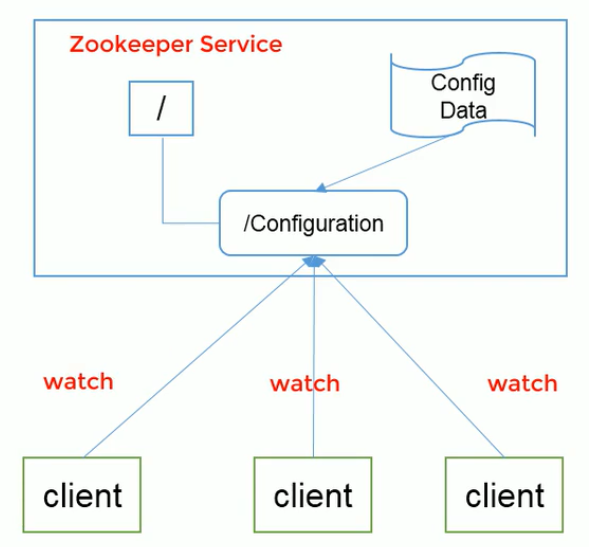

# 一、ZooKeeper入门

## 1、概述

ZooKeeper：**<span style="color:red">为分布式应用提供协调服务</span>，**本质上一个分布式的小文件存储系统

工作机制：使用观察者模式，服务提供者Provider注册到ZooKeeper注册中心，Consumer订阅ZooKeeper

ZooKeeper = 文件系统 + 通知机制


## 2、ZooKeeper特点

**ZooKeeper：一致性，有Leader，数据树**

1）、一个领导者（Leader），多个跟随者（ Follower）组成的集群

**2）、集群中只要有半数以上节点存活，ZooKeeper集群就能正常服务**

3）、全局数据一致：每个Server保存一份相同的数据副本，Client无论连接哪个Server，数据都是一致的。

4）、如果消息被其中一台服务器接受，也会被其它所有的服务器接受

5）、顺序性：包括全局有序和偏序两种：全局有序是指如果在一台服务器上消息a在消息b前发布，则在所有Server上消息a都将在消息b前被发布；

5）、数据更新原子性，一次数据更新要么成功，要么失败

6）、实时性，在一定时间范围内，Client能读到最新数据

## 4、应用场景

1）统一命名服务

​	分布式环境下，经常需要对应用、服务进行统一命名，便于识别

2）统一配置管理

​	1）、可将配置信息写入ZooKeeper上的一个ZNode

​	2）、各个客户端服务器监听这个ZNode

​	3）、一旦ZNode的数据被修改，ZooKeeper将通知各个客户端服务器



4）统一集群管理

5）软负载均衡


5、ZooKeeper集群角色

Leader：

1）ZooKeeper集群工作的核心

2）事务请求（写操作）的唯一调度和处理者，保证集群事务处理的顺序性；

3）集群内部各个服务器的调度者

4）对于create，setData，delete等写操作的请求，则需要统一转发给Leader处理，Leader需要决定编号、执行操作，这个过程称为一个事务

Follower：

1）处理客户端非事务请求（读操作），转发事务请求给Leader

2）参与集群Leader选举投票

此外，针对访问量比较大的ZooKeeper集群，还可以新增观察者角色

Observer：

观察者角色，观察ZooKeeper集群的最新状态变化并将这些状态同步过来，其对于非事务请求可以进行独立处理，对于事务请求，转发给Leader处理。不会参与任何形式的投票，只提供非事务服务


# 二、ZooKeeper环境搭建

虚拟机间主机名的修改

1.需要修改 /etc/hosts，添加主机地址映射如：127.0.0.1  node-1

2.同时修改主机名字 vi  /etc/hostname

3.重启

## 1、安装Java SDK

1）、输入以下命令，以查看可用的JDK软件包列表;

**yum search java | grep -i --color JDK**


2）、在CentOS linux安装 JAVA SDK

在命令行终端以root用户 输入以下命令yum安装 OpenSDK ：

yum install java-1.8.0-openjdk  **java-1.8.0-openjdk-devel** 


**3）配置环境变量**

```bash
vi  /etc/profile

将下面的三行粘贴到 /etc/profile 中：

正确的配置：
export JAVA_HOME=/opt/module/jdk1.8.0_131
export PATH=$PATH:$JAVA_HOME/bin
export CLASSPATH=
.:$JAVA_HOME/jre/lib/rt.jar:$JAVA_HOME/lib/dt.jar:$JAVA_HOME/lib/tools.jar

错误的配置：
export JAVA_HOME=/opt/module/jdk1.8.0_131
export JAVA_PATH=$PATH:$JAVA_HOME/bin
export JAVA_CLASSPATH=
.:$JAVA_HOME/jre/lib/rt.jar:$JAVA_HOME/lib/dt.jar:$JAVA_HOME/lib/tools.jar

```

**<span style="color:red">注意：是PATH，与CLASSPATH：前面没有JAVA</span>**

**配置立即生效：**

```bash
source /etc/profile
```


准备操作：

1）服务器时间是否同步

date

2）关闭防火墙 
一、.对于centos7自带的防火墙的相关指令 

查看防火墙状态

```bash
firewall-cmd --state
```

systemctl stop firewalld.service #停止firewall 
systemctl disable firewalld.service #禁止firewall开机启动 
systemctl status firewalld.service #查看firewall的状态

二、iptables防火墙的相关状态 
关闭虚拟机防火墙： 
关闭命令： service iptables stop 
永久关闭防火墙：chkconfig iptables off 
两个命令同时运行，运行完成后查看防火墙关闭状态 
service iptables status 
1 关闭防火墙—–service iptables stop 
2 启动防火墙—–service iptables start 
3 重启防火墙—–service iptables restart 
4 查看防火墙状态–service iptables status 
5 永久关闭防火墙–chkconfig iptables off 
6 永久关闭后启用–chkconfig iptables on


3）检测主机和IP映射有没有配置


## 2、修改ZooKeeper配置

1）、zoo_sample.cfg 重命名为 zoo.cfg；

```bash
cp zoo_sample.cfg zoo.cfg
```

2）、在ZooKeeper根目录下创建zkData，并修改zoo.cfg中的 dataDir 指向zkData

3）、vi   zoo.cfg 添加内容

**dataDir=/opt/module/zookeeper-3.4.14/zkData**

server.1=node-1:2888:3888   // （心跳端口、选举端口）
server.2=node-2:2888:3888
server.3=node-3:2888:3888

4）在zkData目录下添加服务器编号

```bash
echo 1 > zkData/myid
```

**5）拷贝ZooKeeper至其它集群机器**

```bash
scp -r -- /opt/module/zookeeper-3.4.14/ root@node-2:/opt/module/
```

**注意由于文件夹路径有** - 连接符，因此需要使用 -- （告诉bash不解释 - 后面的内容）

如果node-2主机没有module目录，会自动创建module目录，并把 **<span style="color:red">zookeeper-3.4.14目录下的所有内容</span>** 拷贝到module目录下

如果node-2主机有module目录，则**<span style="color:red"> 拷贝zookeeper-3.4.14整个目录</span>** 至module目录下


## 3、操作ZooKeeper

**1）启动ZooKeeper**

```bash
[root@localhost zookeeper-3.4.14]# bin/zkServer.sh start
```

ZooKeeper JMX enabled by default
Using config: /opt/module/zookeeper-3.4.14/bin/../conf/zoo.cfg
Starting zookeeper ... STARTED

**2）查看进程是否启动**

```bash
[root@localhost zookeeper-3.4.14]# jps
```

16738 Jps
16719 QuorumPeerMain

**3）查看状态**

```bash
[root@localhost zookeeper-3.4.14]# bin/zkServer.sh status
```

[root@node-1 zookeeper-3.4.14]# bin/zkServer.sh status
ZooKeeper JMX enabled by default
Using config: /opt/module/zookeeper-3.4.14/bin/../conf/zoo.cfg
**Mode: follower**   


4）启动客户端

```bash
[root@localhost zookeeper-3.4.14]# bin/zkCli.sh 
```

**注意后面不需要 start**


5）退出客户端

```bash
[zk: localhost:2181(CONNECTED) 3] quit
```

6）退出服务端

```bash
[root@localhost zookeeper-3.4.14]# bin/zkServer.sh stop
```

ZooKeeper JMX enabled by default
Using config: /opt/module/zookeeper-3.4.14/bin/../conf/zoo.cfg
Stopping zookeeper ... STOPPED

## 4、配置参数

**1.tickTime=2000：通信心跳数，ZooKeeper服务器与客户端心跳时间**，

它用于心跳机制，并且设置最小的session超时时间为两倍心跳时间

**2.initLimit=10：LF初始通信时限**

集群中 Follower 与 Leader 领导者服务器之间初始连接时能容忍的最多心跳数，用它来限定集群中的ZooKeeper服务器连接到Leader的时限

**3.syncLimit=5：LF同步通信时限**

集群中Leader与Follower之间的最大响应时间单位，


# 三、ZooKeeper数据模型

Zookeeper数据模型的结构与**Unix文件系统很类似**，拥有一个层次的命名空间，都是采用树形层次结构，ZooKeeper树中的每个节点被称为一个ZNode。和文件系统的目录树一样，ZooKeeper树中的每个节点可以拥有子节点。但也有不同之处：

**1）、ZNode兼具文件和目录两种特点。**既像文件一样维护着数据、元信息、ACL、时间戳等数据结构，**又像目录一样可以作为路径标识的一部分**，并可以具有子ZNode。用户对ZNode具有增、删、改、查等操作（权限允许的情况下）

**2）ZNode具有原子性操作**，读操作将获取与节点相关的所有数据，写操作也将替换节点的所有数据。另外，每一个节点都拥有自己的ACL（访问控制表），这个列表规定了用户的权限，即限定了特定用户对目标节点可以执行的操作。

**3）ZNode存储数据大小有限制。**ZooKeeper虽然可以关联一些数据，但并没有被设计为常规的数据库或者大数据存储，相反的是，它用来管理调度数据，比如分布式应用中的配置文件信息、状态信息、汇集位置等等。**这些数据的共同特性就是它们都是很小的数据，通常以KB为单位**。ZooKeeper的服务器和客户端都被设计为严格检查并限制每个ZNode的数据大小至多1M，但是常规使用中应该远小于此值。

4）ZNode通过路径引用，如同Unix中的文件路径。**路径必须是绝对的**，因此它们必须**由斜杠字符来开头。**除此以外，它们必须是唯一的，也就是说每一个路径只有一个表示，因此这些路径不能改变。在ZooKeeper中，路径由Unicode字符串组成，并且有一些限制。字符串 "/zookeeper" 用以保存管理信息，比如关键配置信息。


## 1、数据结构图


途中的每个节点称为一个ZNode。每个ZNode由3部分组成：

1）、stat：为状态信息，描述该ZNode的版本，权限等信息

2）、data：与该ZNode关联的数据

3）、children：该ZNode下的子节点


## 2、节点类型

Znode有两种，分别为**临时节点和永久节点。**

节点的类型在创建时即被确定，并且不能改变。

临时节点：该节点的生命周期依赖于创建它们的会话。**<span style="color:red">一旦会话结束，临时节点将被自动删除</span>**，当然也可以手动删除。**临时节点不允许拥有子节点**。


永久节点：该节点的生命周期不依赖于会话，并且只有在客户端显示执行删除操作的时候，它们才能被删除。

Znode还有一个序列化的特性，如果创建的时候指定的话，改Znode的名字后面会自动追加一个不断增加的序列号。**序列号对于此节点的父节点来说是唯一的，这样便会记录每个子节点创建的先后顺序**。它的格式为  “%10d” （10位数字，没有数值的数位用0补充，例如 “0000000001”）。

这样便会存在四种类型的Znode节点，分别对应：

​	**PERSISTENT：永久节点**

​	**EPHEMERAL：临时节点**

​	**PERSISTENT_SEQUENTIAL：永久节点、序列化**

​	**EPHEMERAL_SEQUENTIAL：临时节点、序列化**


持久：客户端和服务器端断开连接后，创建的节点不删除

短暂：客户端与服务器端断开连接后，创建的节点自己删除


## 3、节点属性

每个Znode都包含了一系列的属性，通过命令 get，可以获得节点的属性。

**dataVersion：数据版本号，每次对节点进行set操作，dataVersion的值都会增加1**

cversion：子节点的版本号。当Znode的子节点有变化时，cversion的值就会增加1

aclVersion：ACL的版本号

cZxid：Znode创建的事务id

**mZxid：Znode被修改的事务id，即每次对Znode的修改都会更新mZxid。**

对于zk来说，每次的变化都会产生一个唯一的事务id，zxid（ZooKeeper Transaction Id）。通过zxid，可以确定更新操作的先后顺序。例如如果zxid1 小于 zxid2，说明 zxid1 操作先于 zxid2 发生，zxid对于整个zk都是唯一的，即使操作的是不同的Znode。

ctime：节点创建时的时间戳

mtime：节点最近一次更新的时间戳

ephemeralOwner：如果该节点为临时节点，ephemeralOwner值表示与该节点绑定的 session id。如果不是，ephemeralOwner值为0。

在 Client 与 server通信之前，首先需要建立连接，该连接称为 session。连接建立后，如果发生连接超时、授权失败，或者显示关闭连接，连接变处于CLOSED状态，此时session结束。


## 4、ZooKeeper shell

### 1）、客户端连接

```bash
bin/zkCli.sh  // 在当前主机上查找服务

bin/zkCli.sh -server node-1   //连接指定主机的服务
```

### 2）、创建节点

create [-s]  [-e]  path  **data**  acl

其中，-s 或 -e分别指定节点特性，顺序或临时节点，若不指定，则表示

```bash
# 根目录下创建一个永久节点
[zk: localhost:2181(CONNECTED) 0] create /hellozk 123

[zk: localhost:2181(CONNECTED) 3] ls /
[zookeeper, hellozk]

# 集群其它机器，数据一致性
[zk: node-1(CONNECTED) 0] ls /
[zookeeper, hellozk]

# 创建一个临时节点
[zk: localhost:2181(CONNECTED) 0] create -e /zktmp 123456
Created /zktmp
[zk: localhost:2181(CONNECTED) 1] ls /
[zookeeper, hellozk, zktmp]

# 集群另外一个客户端查看，临时节点被自动删除，但需要一定的时间
[zk: localhost:2181(CONNECTED) 13] ls /
[zookeeper, hellozk, zktmp]
[zk: localhost:2181(CONNECTED) 14] ls /
[zookeeper, hellozk]
```

2）创建序列化节点

```bash
[zk: localhost:2181(CONNECTED) 1] create -s /a 123
Created /a0000000002
[zk: localhost:2181(CONNECTED) 2] ls /
[a0000000002, zookeeper, hellozk]
[zk: localhost:2181(CONNECTED) 3] create -s /b 123
Created /b0000000003
[zk: localhost:2181(CONNECTED) 4] ls /
[b0000000003, a0000000002, zookeeper, hellozk]


#在 /hellozk 节点下创建顺序节点，序号从0开始
[zk: localhost:2181(CONNECTED) 1] create -s /hellozk/a 456
Created /hellozk/a0000000000

```


### 3）、读取节点

与读取节点相关的命令有 **ls** 和 **get** 命令，ls 命令可以列出ZooKeeper指定节点下的所有子节点，只能查看指定节点下的第一级的所有子节点；**get命令可以获取ZooKeeper指定节点的数据内容和属性信息。**

​	ls	path [watch]

​	get	path [watch]

​	ls2	path [watch]

```bash
[zk: localhost:2181(CONNECTED) 6] get /hellozk
123
cZxid = 0x600000003
ctime = Mon Sep 16 04:29:20 EDT 2019
mZxid = 0x600000003 	# 事务修改
mtime = Mon Sep 16 04:29:20 EDT 2019
pZxid = 0x600000010
cversion = 2
dataVersion = 0
aclVersion = 0
ephemeralOwner = 0x0    # 非临时节点
dataLength = 3			# 数据长度
numChildren = 2			# 子节点个数

# ls2 跟 get 命令基本一致，但不能显示节点数据
[zk: localhost:2181(CONNECTED) 7] ls2 /hellozk
[a0000000000, a0000000001]
cZxid = 0x600000003
ctime = Mon Sep 16 04:29:20 EDT 2019
mZxid = 0x600000003
mtime = Mon Sep 16 04:29:20 EDT 2019
pZxid = 0x600000010
cversion = 2
dataVersion = 0
aclVersion = 0
ephemeralOwner = 0x0
dataLength = 3
numChildren = 2
```

### 4）、更新节点

​	set	path	data	[version]

​	data 就是要更新的内容，version表示数据版本

```bash
[zk: localhost:2181(CONNECTED) 9] set /hellozk 456
cZxid = 0x600000003
ctime = Mon Sep 16 04:29:20 EDT 2019
mZxid = 0x600000011 #修改事务id
mtime = Mon Sep 16 04:55:20 EDT 2019
pZxid = 0x600000010
cversion = 2
dataVersion = 1		# 数据版本更新为了1
aclVersion = 0
ephemeralOwner = 0x0
dataLength = 3
numChildren = 2

[zk: localhost:2181(CONNECTED) 11] set /hellozk 789
cZxid = 0x600000003
ctime = Mon Sep 16 04:29:20 EDT 2019
mZxid = 0x600000012
mtime = Mon Sep 16 04:55:50 EDT 2019
pZxid = 0x600000010
cversion = 2
dataVersion = 2		# 数据版本更新为了2
aclVersion = 0
ephemeralOwner = 0x0
dataLength = 3
numChildren = 2

# 如果添加版本参数，必须指定当前版本
[zk: localhost:2181(CONNECTED) 12] set /hellozk 789 1
version No is not valid : /hellozk
```

dataVersion变为了2，表示进行了两次更新

### 5）、删除节点

​	delete	path	[version]

若删除节点存在子节点，那么无法删除该节点，必须先删除子节点，再删除

```ba
[zk: localhost:2181(CONNECTED) 13] delete /hellozk
Node not empty: /hellozk

```

可以使用 Rmr	path 递归删除子节点


### 6）、quota

​	setquota	-n|-b	val	path 对节点增加限制：**温性的限制，不会报错，日志中警告**

​	n：表示子节点的最大个数

​	b：表示子节点的最大长度

​	val：子节点最大个数或数据值的最大长度

​	path：节点路径

```bash
[zk: localhost:2181(CONNECTED) 29] setquota -n 3 /testquota
Comment: the parts are option -n val 3 path /testquota
```


listquota 	path 列出指定节点的 quota**

```bash
[zk: localhost:2181(CONNECTED) 30] listquota /testquota
absolute path is /zookeeper/quota/testquota/zookeeper_limits
Output quota for /testquota count=3,bytes=-1
Output stat for /testquota count=1,bytes=6  
# 节点为1，包括自身，数据长度为 -1 ，表示没有限制

```

如果子节点操作了最大限制，不会报错，log有警告信息

```bash
2019-09-16 05:20:17,035 [myid:3] - WARN  [CommitProcessor:3:DataTree@302] - Quota exceeded: /testquota count=4 limit=3
2019-09-16 05:21:33,071 [myid:3] - WARN  [CommitProcessor:3:DataTree@302] - Quota exceeded: /testquota count=5 limit=3
```


删除子节点限制：

delquota	[-n|-b]	path：删除quota


其它命令

history：列出历史命令

redo：重新执行指定命令编号的历史命令


## 5、ZooKeeper Watcher

### 1）、事件类型


watchEvent事件封装：

事件状态，事件类型，路径

设置节点数据变动监听：

```bash
[zk: localhost:2181(CONNECTED) 10] get /watchtest watch
123
cZxid = 0x600000023
ctime = Mon Sep 16 06:15:53 EDT 2019
mZxid = 0x600000023
mtime = Mon Sep 16 06:15:53 EDT 2019
pZxid = 0x600000023
cversion = 0
dataVersion = 0
aclVersion = 0
ephemeralOwner = 0x0
dataLength = 3
numChildren = 0
```

通过另一个客户端修改节点数据：

```bash
[zk: localhost:2181(CONNECTED) 1] set /watchtest 456789
cZxid = 0x600000023
ctime = Mon Sep 16 06:15:53 EDT 2019
mZxid = 0x600000025
mtime = Mon Sep 16 06:16:57 EDT 2019
pZxid = 0x600000023
cversion = 0
dataVersion = 1
aclVersion = 0
ephemeralOwner = 0x0
dataLength = 6
numChildren = 0
```


**收到数据变动事件：**

```ba
WATCHER::

WatchedEvent state:SyncConnected type:NodeDataChanged path:/watchtest
```

**注意：如果再次修改节点数据，不会发出事件了，事件是一次性触发的；需要重新注册**

ls	path	watch：监听节点路径的变化

get	path	watch：监听节点数据的变化	


### 2）、监听器原理


## 6、ZooKeeper Java API

**org.apache.zookeeper.ZooKeeper**

​	ZooKeeper是在Java中客户端主类，负责建立与 zookeeper集群的会话，并提供方法进行操作。

**org.apache.zookeeper.Watcher**

​	Watcher接口表示一个标准的事件处理器，其定义了事件通知相关的逻辑，包含 KeeperState 和 EventType两个枚举类，分别代表了通知状态和事件类型，同时定义了事件回调方法：process（WatcherEvent   event）

​	process方式是Watcher接口中的一个回调方法，当ZooKeeper向客户端发送一个Watcher事件通知时，客户端就会对相应的 process方法进行回调，从而实现对事件的处理


# 四、ZooKeeper选举机制

半数机制：集群中半数以上机器存活，集群可用。所以ZooKeeper适合安装奇数台服务器

ZooKeeper默认算法是 FastLeaderElection，采用投票数大于半数则胜出的逻辑。

## 1、概念

服务器ID

​	比如有三台服务器，编号分别是1,2,3.

​	编号越大在选择算法中的权重越大

选举状态

​	LOOKING，竞选状态

​	FOLLOWING，随从状态，同步 Leader状态，参与投票

​	OBSERVING，观察状态，同步 Leader 状态，不参与投票

​	LEADING，领导者状态

数据ID

​	服务器中存放的最新数据 version

​	值越大说明数据越新，在选举算法中数据越新权重越大

逻辑时钟

​	也叫投票的次数，同一轮投票过程中的逻辑时钟值是相同的。每投完一次票这个数据就会增加，然后与接收到的其它服务器返回的投票信息中的数值相比，根据不同的值做出不同的判断。


## 2、全新集群选举

1）、每个机器都给自己投票

**2）、投票数过半，选举结束**

最有优势的是投票数刚过半数的那台机器

假设目前有5台服务器，每台服务器均没有数据，它们的编号分别是1,2,3,4,5，按编号依次启动，它们的选举过程如下：

​	服务器1启动，给自己投票，然后发投票信息，由于其它机器还没有启动所以它收不到反馈信息，服务器1 的状态一直属于looking

​	服务器2启动，给自己投票，**同时与之前启动的服务器1交换结果**，**由于服务器2的编号大所以服务器2胜出，**但此时投票数没有大于半数，所以两个服务器的状态依然是looking

​	**服务器3启动，给自己投票，同时与之前启动的服务器1,2交换信息，由于服务器3的编号最大所以服务器3胜出，此时投票数正好大于半数，所以服务器3成为领导者，服务器1,2成为小弟；投票到此结束**

​	服务器4启动给自己投票，同时与之前启动服务器1,2,3交换信息，尽管服务器4的编号大，但之前服务器3已经胜出，所以服务器4只能成为小弟。

​	服务器5启动，同服务器4


## 3、非全新集群选举

对于运行正常的ZooKeeper集群，**中途中机器 down 掉，需要重新选举时**，选举过程就需要加入**数据ID**、**服务器ID**和**逻辑时钟**

​	数据ID：数据新的 version 就大，数据每次更新都会更新 version。

​	服务器ID：就是我们配置的 myid 中的值，每个机器一个

​	逻辑时钟：这个值从 0 开始递增，每次选举对应一个值。如果在同一次选举中，这个值是一致的。

这个选举的标准就变成：

​	1、逻辑时钟小的选举结果被忽略，重新投票

​	2、统一逻辑时钟后，数据 id 大的胜出；

​	3、数据id相同的情况下，服务器 id 大的胜出；

根据这个规则选出 leader。


# 五、写数据流程


# 六、ZooKeeper典型应用

## 1、数据发布与订阅（配置中心）

发布与订阅模型，即所谓的配置中心，顾名思义就是发布者将数据发布到

ZK 的节点上，供订阅者动态获取数据，实现配置信息的集中式管理和动态更新。

应用在启动的时候会主动来获取一次配置，同时，在节点上注册一个 Watcher，这样一来，以后每次配置有更新的时候，都会实时通知到订阅的客户端，从而达到获取最新配置信息的目的。比如：

在分布式搜索服务中，索引的元信息和服务器集群节点状态存放在 ZK 的一些指定节点，供各个客户端订阅使用。

**注意：适合数据量很小的场景，这样数据更新可能会比较快。**

案例：

1）所有订阅者初次启动的时候去 zk 指定的节点获取相关的订阅信息（数据库相关信息）

2）获取数据的同时，还要设置监听，监听节点数据的变化

3）一旦节点数据发生变化，监听就会被触发，我们的各个应用（订阅者，相对于 zk来说就是客户端）就会收到事件的通知，从而去获取新的配置信息

**4）还要再次设置相同的监听，保证下次数据变化也能收到事件**


## 2、命名服务（Naming Service）

在分布式系统中，通过使用命名服务，客户端应用能够根据指定名字来获取资源或服务的地址，提供者等信息。被命名的实体通常可以是集群中的机器，提供的服务地址，远程对象等。

分布式服务框架 Dubbo 中使用 ZooKeeper来作为其命名服务，维护全局的服务地址列表。


## 3、分布式锁

分布式锁，这个主要得益于 ZooKeeper 保证了数据的强一致性。锁服务可以分为两类，一个是保持独占，另一个是控制时序。

所谓保持独占，就是所有试图来获取这个锁的客户端，最终只有一个可以成功获得这把锁。通常的做法是把 zk 上的一个Znode看作死一把锁，通过 create Znode的方式来实现。所有客户端都去创建 、distribute_lock 节点，**最终成功创建的那个客户端也即拥有了这把锁。**


控制时序，就是所有试图来获取这个锁的客户端，最终都是会被安排执行，只是有个全局时序了。做法和上面基本类似，只是这里 /distribute_lock 已经预先存在，客户端在它下面创建临时有序节点（这个可以通过节点的属性控制：CreateMode.EPHEMERAL_SEQUENTIAL来指定）。Zk的父节点（/distribute_lock）维持一份sequence，保证子节点创建的时序性，从而也形成了每个客户端的全局时序。


# 七、服务上下线案例

服务注册：

```java
/**
 * 提供服务的节点，需要注册到ZooKeeper集群中，相对于集群来说也是客户端
 */
public class DistributeServer {
    static String connectString = "node-1:2181,node-2:2181,node-3:2181";
    private static ZooKeeper zkClient;

    public static void main(String[] args) throws IOException, InterruptedException {

        DistributeServer server = new DistributeServer();
        // 1、连接ZooKeeper集群
        server.connect();

        // 2、注册服务
        server.register(args[0]); // 传递节点的数据

        // 3、执行业务
        server.doBusiness();
    }

    private void connect() throws IOException {
        zkClient = new ZooKeeper(connectString, 2000, new Watcher() {
            @Override
            public void process(WatchedEvent watchedEvent) {

            }
        });
    }

    private void register(String hostName) {
        System.out.println("hostNmae="+hostName);
        try {
            // -e 创建服务为临时节点，-s 为序列节点；服务上下线必须为临时节点，为了避免节点名称问题，使用序列节点
            // 相当于挂载服务，客户端注册监听事件后，就可以监听节点变化
            String path = zkClient.create("/servers/server", hostName.getBytes(), ZooDefs.Ids.OPEN_ACL_UNSAFE, CreateMode.EPHEMERAL_SEQUENTIAL);
            System.out.println(path + " is online ");
        } catch (KeeperException e) {
            e.printStackTrace();
        } catch (InterruptedException e) {
            e.printStackTrace();
        }
    }

    private void doBusiness() throws InterruptedException {
        Thread.sleep(Long.MAX_VALUE);  // 避免服务进程退出
    }

}
```

客户端监听事件：

```java
/**
 * 向ZooKeeper集群注册服务节点的监听，是客户端
 */
public class DistributeClient {

    ZooKeeper zkClient;
    static String connectString = "node-1:2181,node-2:2181,node-3:2181";

    public static void main(String[] args) throws IOException, KeeperException, InterruptedException {

        DistributeClient client = new DistributeClient();
        // 1、连接集群
        client.connect();

        // 2、注册监听
        client.getChildren();

        // 3、执行业务
        client.business();
    }

    private void connect() throws IOException {
        zkClient = new ZooKeeper(connectString, 2000, new Watcher() {
            @Override
            public void process(WatchedEvent watchedEvent) {
                try {
                    getChildren();
                } catch (KeeperException e) {
                    e.printStackTrace();
                } catch (InterruptedException e) {
                    e.printStackTrace();
                }
            }
        });

        System.out.println(zkClient);
    }

    private void getChildren() throws KeeperException, InterruptedException {
        List<String> children = zkClient.getChildren("/servers", true);
        // 存储服务器节点主机名称集合
        List<String> datas = new ArrayList<>();
        for (String child : children) {
            byte[] data = zkClient.getData("/servers/" + child, false, null); // 不监听子节点变化
            datas.add(new String(data));
        }
        System.out.println(datas);
    }

    private void business() throws InterruptedException {
        Thread.sleep(Long.MAX_VALUE);
    }
}

```


# 七、RPC

RPC（Remote Procedure Call Protocol）远程过程调用协议

一种通过网络从远程计算机上请求服务，而不需要了解底层网络技术的协议。

## 1、主要特质

1）RPC是协议：协议意味着规范。目前典型的RPC实现包括：Dubbo、Thrift、Hetty等。

2）网络协议和网络IO模型对其透明：既然RPC的客户端认为自己是在调用本地对象。那么传输层使用的是 TCP/UDP还是HTTP协议，又或者是其它网络协议它就不需要关心了。既然网络协议对其透明，那么调用过程中，使用的是哪一种IO模型调用者也不需要关心。

3）信息格式对其透明：

4）跨语言能力：对于调用方来说，不知道也无需知道远程程序使用的是什么语言运行的。


## 2、RPC原理

实现RPC程序包括5个部分：User、User-stub、RPCRuntime、Server-stub、Server。


​	user 就是发起 RPC 调用的 Client，当 user 想发起一个远程调用时，它实际是通过本地调用 user-stub。user-stub 负责将调用的接口、方法和参数通过约定的协议规范进行编码并通过本地的 RPCRuntime 实例传输到远端的实例。远端 RPCRuntime实例收到请求后交给 server-stub进行解码后发起本地端调用，调用结果再返回给 user 端。

​	stub，为屏蔽客户调用远程主机上的对象，必须提供某种方式模拟本地对象，这种本地对象称为存根（stub），存根负责接收本地方法调用，并将它们委派给各自的具体实现对象。


# 十、相关问题

## 1、环境相关

ZooKeeper启动后，查看状态报错

[root@localhost zookeeper-3.4.14]# bin/zkServer.sh status
ZooKeeper JMX enabled by default
Using config: /opt/module/zookeeper-3.4.14/bin/../conf/zoo.cfg
**Error contacting service. It is probably not running**

原因1：jdk环境没有配置


原因2：

**查看：zookeeper.out文件**分析问题原因：连接不上主机

**修改集群中每个主机的 /etc/hosts 文件配置 主机IP地址映射**

```bash
192.168.199.119   node-1
```


原因3：

首次启动，如果不够半数主机启动，也可能报以上错误


参考：

[传智]: https://www.bilibili.com/video/av47125971/?p=11
[尚硅谷]: https://www.bilibili.com/video/av32093417/?p=19


